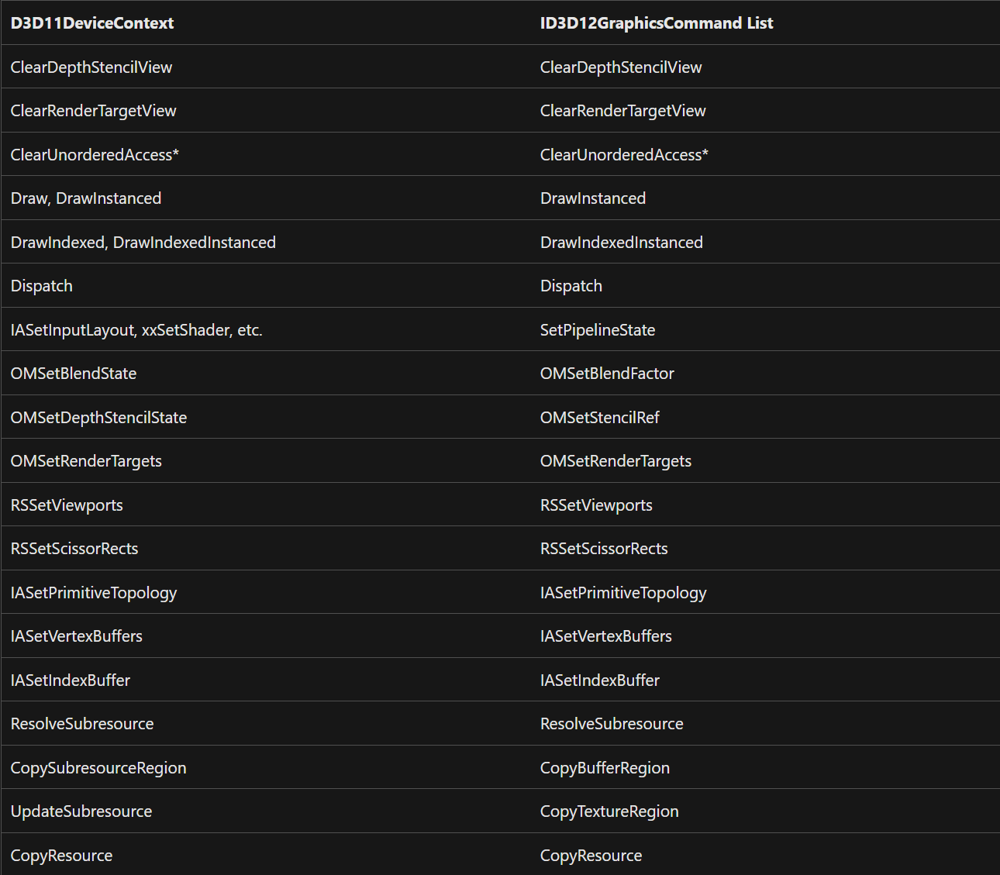

# DX12中的Draw Call优化

Draw call优化是在整个性能优化中非常重要的一环，越多的Draw call就意味着Cpu和Gpu之间的数据传输越多，对于渲染效率的影响也就越大，很多时候渲染效率低下的瓶颈不在于Gpu的运算效率，而在于Gpu的IO效率或者是渲染管线上下文的等待和切换。因此优化Draw call就成了性能优化中一个非常重要的课题。

## 普通的的Draw

先来看看普通的绘制手段，例如DX11中的Draw或是DrawIndexed，例如Vulkan中的vkCmdDraw或者是vkCmdDrawndexed，调用这些api会将一串Vertex Buffer和Index Buffer传递给GPU，来将这些顶点组成的三角面片绘制出来，但这些顶点拥有相同的世界矩阵，拥有相同的材质属性，因此调用这些api所得到的结果一般是一个物体对应一个单独的Draw Call。

那么问题来了，如果在一个场景中，需要绘制大量相同或是类似的物件，有没有更好的办法来实现呢。于是就有了Instanced Draw的解决方案。

## Instanced Draw

在DX12的官方文档中，DX11的Draw和DrawIndexed两个api已经全都整合成了DrawInstanced和DrawIndexedInstanced。



为什么这两个api可以被整合起来，回想一下Instanced Draw和普通的Draw之间的不同之处。普通的Draw在传递Vertex数据的时候，顶点数据的Layout中每个顶点都包含有一份独特的数据，包括顶点的Postion，顶点的Color，以及该顶点的UV等等。如果在顶点中存放更多的数据，例如在世界空间中的偏移，接着在顶点着色器中进行调用，则可以在同一个Draw Call中绘制出更多的物件出来。只不过这些数据每一个物件的顶点都只需要一份，而不需要每个顶点都保存一份。这样又能够把现存和带宽给节省下来。而这也是Instanced Draw的整体思想所在。

当你在DX中去声明一个InputLayout的时候，DX提供了这样一个标识符来帮助你识别该数据是Vertex数据还是Instance数据。

```cpp
typedef 
enum D3D12_INPUT_CLASSIFICATION
{
    D3D12_INPUT_CLASSIFICATION_PER_VERTEX_DATA	= 0,
    D3D12_INPUT_CLASSIFICATION_PER_INSTANCE_DATA	= 1
} 	D3D12_INPUT_CLASSIFICATION;
```

于是，当你去定义一个InputLayout时，如果不需要Instance数据，则可以简单地定义为

```cpp
// Define the vertex input layout.
D3D12_INPUT_ELEMENT_DESC inputElementDescs[] =
{
    { "POSITION", 0, DXGI_FORMAT_R32G32B32_FLOAT, 0, 0, D3D12_INPUT_CLASSIFICATION_PER_VERTEX_DATA, 0 },
    { "COLOR", 0, DXGI_FORMAT_R32G32B32A32_FLOAT, 0, 12, D3D12_INPUT_CLASSIFICATION_PER_VERTEX_DATA, 0 }
};
```

如果要将他更改为Instance的方式进行绘制，则可以在后方加上Instance的数据

```cpp
// Define the vertex input layout.
D3D12_INPUT_ELEMENT_DESC inputElementDescs[] =
{
    { "POSITION", 0, DXGI_FORMAT_R32G32B32_FLOAT, 0, 0, D3D12_INPUT_CLASSIFICATION_PER_VERTEX_DATA, 0 },
    { "COLOR", 0, DXGI_FORMAT_R32G32B32A32_FLOAT, 0, 12, D3D12_INPUT_CLASSIFICATION_PER_VERTEX_DATA, 0 },
    { "WORLD", 0, DXGI_FORMAT_R32G32B32A32_FLOAT, 1, 0, D3D12_INPUT_CLASSIFICATION_PER_INSTANCE_DATA, 0 },
    { "WORLD", 0, DXGI_FORMAT_R32G32B32A32_FLOAT, 1, 16, D3D12_INPUT_CLASSIFICATION_PER_INSTANCE_DATA, 0 },
    { "WORLD", 0, DXGI_FORMAT_R32G32B32A32_FLOAT, 1, 32, D3D12_INPUT_CLASSIFICATION_PER_INSTANCE_DATA, 0 },
    { "WORLD", 0, DXGI_FORMAT_R32G32B32A32_FLOAT, 1, 48, D3D12_INPUT_CLASSIFICATION_PER_INSTANCE_DATA, 0 }
};
```

接着在Shader当中直接取用Instance数据即可。

但是这种绘制方式也有不少受限的地方，受限需要物件是相同模型以及相同材质的，尽管可以给每个物件传递不同的参数来表现出不同的效果，但终究还是受到限制，那么有没有一种更加自由的方式去用单个Draw Call去绘制不同的物件，于是Indirect Draw就横空出世了。

## Indirect Draw

对Indirect Draw的简单理解就是将一系列Instance Draw的指令进行打包处理，在CPU端准备好数据指令之后，一次性全部递交到GPU，接着让GPU按照已经指定好的内存排布去计算绘制这一串指令。

DX12的官方Sample中提供了一个展示Indirect Draw用法的案例，以下就以该案例为例子来进行说明。

DX12中使用ExecuteIndirect指令来执行Indirect Draw，ExecuteIndirect函数的声明如下

```cpp
virtual void STDMETHODCALLTYPE ExecuteIndirect( 
  //指定签名，pArgumentBuffer中的内容将根据签名来进行解释
  _In_  ID3D12CommandSignature *pCommandSignature,
  //指令数量
  _In_  UINT MaxCommandCount,
  //存储指令的Buffer
  _In_  ID3D12Resource *pArgumentBuffer,
  //每一个指令在Buffer中的偏移
  _In_  UINT64 ArgumentBufferOffset,
  //计数缓冲区
  _In_opt_  ID3D12Resource *pCountBuffer,
  //计数缓冲区偏移
  _In_  UINT64 CountBufferOffset);
```

可以发现该函数的执行与上述Draw或是InstancedDraw不同，需要一个签名来对指令中的内容进行解释，签名的创建过程如下

```cpp
// Each command consists of a CBV update and a DrawInstanced call.
D3D12_INDIRECT_ARGUMENT_DESC argumentDescs[2] = {};
argumentDescs[0].Type = D3D12_INDIRECT_ARGUMENT_TYPE_CONSTANT_BUFFER_VIEW;
argumentDescs[0].ConstantBufferView.RootParameterIndex = Cbv;
argumentDescs[1].Type = D3D12_INDIRECT_ARGUMENT_TYPE_DRAW;

D3D12_COMMAND_SIGNATURE_DESC commandSignatureDesc = {};
commandSignatureDesc.pArgumentDescs = argumentDescs;
commandSignatureDesc.NumArgumentDescs = _countof(argumentDescs);
commandSignatureDesc.ByteStride = sizeof(IndirectCommand);

ThrowIfFailed(m_device->CreateCommandSignature(&commandSignatureDesc, m_rootSignature.Get(), IID_PPV_ARGS(&m_commandSignature)));
NAME_D3D12_OBJECT(m_commandSignature);
```

签名中声明了每个Command都包含一个Constant Buffer和一个Instanced Draw Call。签名创建完成后，则是准备创建CommandBuffer以及CommandList中每一个绘制Command，CommandBuffer的创建过程如下

```cpp
std::vector<IndirectCommand> commands;
commands.resize(TriangleResourceCount);
const UINT commandBufferSize = CommandSizePerFrame * FrameCount;

//创建Command Buffer
D3D12_RESOURCE_DESC commandBufferDesc = CD3DX12_RESOURCE_DESC::Buffer(commandBufferSize);
ThrowIfFailed(m_device->CreateCommittedResource(
    &CD3DX12_HEAP_PROPERTIES(D3D12_HEAP_TYPE_DEFAULT),
    D3D12_HEAP_FLAG_NONE,
    &commandBufferDesc,
    D3D12_RESOURCE_STATE_COPY_DEST,
    nullptr,
    IID_PPV_ARGS(&m_commandBuffer)));

ThrowIfFailed(m_device->CreateCommittedResource(
    &CD3DX12_HEAP_PROPERTIES(D3D12_HEAP_TYPE_UPLOAD),
    D3D12_HEAP_FLAG_NONE,
    &CD3DX12_RESOURCE_DESC::Buffer(commandBufferSize),
    D3D12_RESOURCE_STATE_GENERIC_READ,
    nullptr,
    IID_PPV_ARGS(&commandBufferUpload)));

NAME_D3D12_OBJECT(m_commandBuffer);

D3D12_GPU_VIRTUAL_ADDRESS gpuAddress = m_constantBuffer->GetGPUVirtualAddress();
UINT commandIndex = 0;

//整理Command Data，Command Data中包含绘制所使用的一系列Commands
for (UINT frame = 0; frame < FrameCount; frame++)
{
    for (UINT n = 0; n < TriangleCount; n++)
    {
        commands[commandIndex].cbv = gpuAddress;
        commands[commandIndex].drawArguments.VertexCountPerInstance = 3;
        commands[commandIndex].drawArguments.InstanceCount = 1;
        commands[commandIndex].drawArguments.StartVertexLocation = 0;
        commands[commandIndex].drawArguments.StartInstanceLocation = 0;

        commandIndex++;
        gpuAddress += sizeof(SceneConstantBuffer);
    }
}

// Copy data to the intermediate upload heap and then schedule a copy
// from the upload heap to the command buffer.
D3D12_SUBRESOURCE_DATA commandData = {};
commandData.pData = reinterpret_cast<UINT8*>(&commands[0]);
commandData.RowPitch = commandBufferSize;
commandData.SlicePitch = commandData.RowPitch;

UpdateSubresources<1>(m_commandList.Get(), m_commandBuffer.Get(), commandBufferUpload.Get(), 0, 0, 1, &commandData);
m_commandList->ResourceBarrier(1, &CD3DX12_RESOURCE_BARRIER::Transition(m_commandBuffer.Get(), D3D12_RESOURCE_STATE_COPY_DEST, D3D12_RESOURCE_STATE_NON_PIXEL_SHADER_RESOURCE));

//创建与CommandBuffer关联的SRV
// Create SRVs for the command buffers.
D3D12_SHADER_RESOURCE_VIEW_DESC srvDesc = {};
srvDesc.Format = DXGI_FORMAT_UNKNOWN;
srvDesc.ViewDimension = D3D12_SRV_DIMENSION_BUFFER;
srvDesc.Shader4ComponentMapping = D3D12_DEFAULT_SHADER_4_COMPONENT_MAPPING;
srvDesc.Buffer.NumElements = TriangleCount;
srvDesc.Buffer.StructureByteStride = sizeof(IndirectCommand);
srvDesc.Buffer.Flags = D3D12_BUFFER_SRV_FLAG_NONE;

CD3DX12_CPU_DESCRIPTOR_HANDLE commandsHandle(m_cbvSrvUavHeap->GetCPUDescriptorHandleForHeapStart(), CommandsOffset, m_cbvSrvUavDescriptorSize);
for (UINT frame = 0; frame < FrameCount; frame++)
{
    srvDesc.Buffer.FirstElement = frame * TriangleCount;
    m_device->CreateShaderResourceView(m_commandBuffer.Get(), &srvDesc, commandsHandle);
    commandsHandle.Offset(CbvSrvUavDescriptorCountPerFrame, m_cbvSrvUavDescriptorSize);
}
```

可以发现CommandBuffer的创建大致可以分为三个步骤

1. 使用描述符创建CommandBuffer资源
2. 整理Commands，并将CommandData拷贝到CommandBuffer中
3. 创建与Command Buffer关联的SRV

其中，每个Command由一个Constant Buffer以及一个存放Instance Draw参数的结构体组成，具体组成部分如下

```cpp
typedef UINT64 D3D12_GPU_VIRTUAL_ADDRESS;

typedef struct D3D12_DRAW_ARGUMENTS
{
UINT VertexCountPerInstance;
UINT InstanceCount;
UINT StartVertexLocation;
UINT StartInstanceLocation;
} 	D3D12_DRAW_ARGUMENTS;

// Data structure to match the command signature used for ExecuteIndirect.
struct IndirectCommand
{
    D3D12_GPU_VIRTUAL_ADDRESS cbv;
    D3D12_DRAW_ARGUMENTS drawArguments;
};
```

至此，已经完成了Indirect Draw中最重要的资源的创建工作，每个Command中数据的创建以及初始化，则和Instance Draw的创建以及初始化大同小异，也就不再过多介绍。

然而，在实际使用过程中，当我们使用Indirect Draw来绘制时，通常也会将Culling部分放到Compute Shader中来进行，在DX12这个官方案例中，也包含这种情况下Indirect Draw的使用。

在使用Compoute Shader的过程中，需要多创建一份UAV来保存Compute Shader执行之后的结果。之后，则只需要保证Compute Shader以及Indirect Draw的执行时序没有问题即可。

## 结语

关于Indirect Draw，其实最先的接触是在项目当中开发地形渲染相关的部分。尽管当时依葫芦画瓢，也还算顺顺利利地完成了开发，但回过头来看，其实对整个过程，以及上述各种不同的绘制方式之间的区别和差异并不是十分清楚，这才想着回到DX12，从最底层开始梳理一遍整个流程，以及各种Draw之间在实现上的差异在哪里。

总的来说，DX12的官方Sample还算是通俗易懂条理清晰，这次也是受益良多。