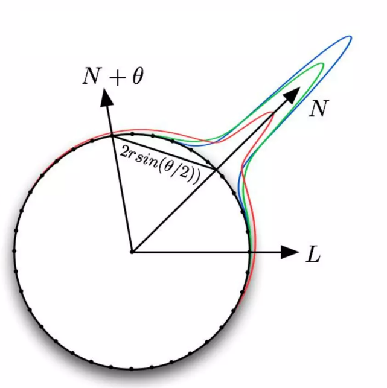
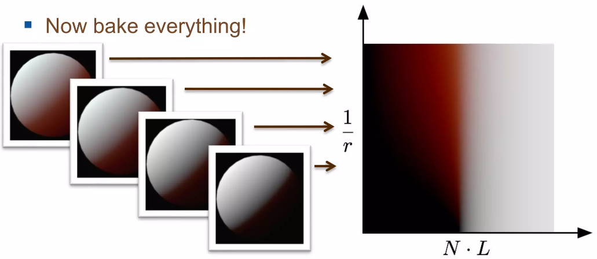

# 对Pre-Integrated Skin的一点理解

SSS（次表面散射）是光照进入介质之后，通过多次反射影响入射点周围的一种现象，在皮肤渲染的过程中SSS是必不可少的一项，SSS的存在能够让皮肤看起来变得更加通透柔和。而 Pre-Integrated Skin 这种光照模型让皮肤的的SSS项获取成本变得更加低廉，也就是更加性能友好，本文就来写写一些对于该光照模型的理解。

## Pre-Integrated BRDF

下面这张图即是该算法的核心思想。



对应的方程为

$$ D(\theta, r) = \frac{\int^\pi_{-\pi}saturate(cos(\theta+x))\cdot R(2r\cdot sin(x/2))dx}{\int^\pi_{-\pi}R(2r\cdot sin(x/2))dx} $$

这个方程代表的含义，用更加通俗的语言来表示的话，就是相当于1单位强度的光照在打到球形介质表面时，扩散到球形表面其他点的光照强度结果。

对于这个方程，网上有几个不同的版本，以下说说自己对于这个方程的理解

- 积分区间为(-pi, pi)还是(-pi/2, pi/2)，该方程表达的是球体表面的散射对于表面的影响，对于光照方向背面的点，依旧可能会受到来自正面的点的光线扩散的影响，因此此处的积分应该是(-pi, pi)，对于该点是正面还是背面，已经在staurate(cos(theta+x))这部分中做了区分。

- 对于方程中的参数r，原文中的方程应该直接取了r=1从而省略。该细节也可以从后面几页PPT中看出，当作者在放大或者缩小球的体积时，所呈现出来的表现也各不相同。而最后预渲染的图，也表示为在各个不同的曲率半径下（纵坐标 $ 1/r $），不同的法线入射光夹角（横坐标 $ N\cdot L $）所呈现出来的光照散射结果。用最通俗易懂的方式去理解这张图的话，就是图上的每一行，都是一个不同半径的球在同一光照角度下每个区域的不同表现。也就是PPT的图中所表示的那样。



- 当扩散函数选择使用高斯拟合的Diffusion Profile时，在进行(-pi, pi)之间的积分时，图会显得更红，并且右上角会表现出蓝色，可以尝试使用Burly's Normalized Diffusion Model, 如果积分区域是(-pi/2, pi/2)时，红色的部分会有所减少，造成此现象的原因可以理解为红色光能够被扩散地更远，扩大积分区域会导致受红色光扩散影响的区域更广，而这些区域红色光能量的增加，同样也会导致在高亮区域红色光能量的减少，从而呈现出蓝色。

以下是简单的推到过程

假设L方向的光照强度为1，则任取一点Q，该点的光照强度为

$$ cos(x + \theta) $$

记反射率为$ q(x) $，则该点对相距dx的另一个点P的散射强度为

$$ cos(x + \theta)q(x)\Delta x $$

把所有点的散射强度进行积分，则P点所受的所有的散射强度总和为

$$ D(\theta)= \int^\pi_{-\pi}cos(\theta + x)q(x)dx $$

P和Q之间的夹角为x，则PQ之间的距离为

$$ 2r \cdot sin(x/2) $$

$ q(x) $是一个表示散射特性的函数，因此可以取光线的扩散剖面函数R（d），使其满足能量守恒，得到下面的式子，其中$ q(x)=kR(d) $

$$ \int^\pi_{-\pi}q(x)dx = 1 $$

算出$ q(x) $，代入原方程可得最终方程

$$ D(\theta, r) = \frac{\int^\pi_{-\pi}saturate(cos(\theta+x))\cdot R(2r\cdot sin(x/2))dx}{\int^\pi_{-\pi}R(2r\cdot sin(x/2))dx} $$

## UE中的PreIntegrate Skin Shading Model

UE中的PreIntegrate Skin使用了一个专门的Shading Model来实现，实现方式也比较简单，以下就是该Shading Model的BRDF代码

```cpp
FDirectLighting PreintegratedSkinBxDF( FGBufferData GBuffer, half3 N, half3 V, half3 L, float Falloff, half NoL, FAreaLight AreaLight, FShadowTerms Shadow )
{
	FDirectLighting Lighting = DefaultLitBxDF( GBuffer, N, V, L, Falloff, NoL, AreaLight, Shadow );
	
	half3 SubsurfaceColor = ExtractSubsurfaceColor(GBuffer);
	half Opacity = GBuffer.CustomData.a;

	half3 PreintegratedBRDF = Texture2DSampleLevel(View.PreIntegratedBRDF, View.PreIntegratedBRDFSampler, float2(saturate(dot(N, L) * .5 + .5), 1 - Opacity), 0).rgb;
	Lighting.Transmission = AreaLight.FalloffColor * Falloff * PreintegratedBRDF * SubsurfaceColor;

	return Lighting;
}
```

可以发现UE的PreIntegrate Skin Shading Model使用了Lambert Diffuse加上GGX Specular，最后把SSS放到了Transmission项中，并使用与Diffuse和Specular不同的Shadow Mask来进行处理。

其中View.PreIntegratedBRDF就是预积分的烘焙贴图，也一并存放在引擎资源当中。但是需要注意的是，打开这张帖图可以发现UE在贴图的设置选项中勾选了SRGB选项，个人看来这里不该勾选SRGB，因为积分的结果都是从0-1的，每一个像素点的数值都是计算出来的该点次表面反射强度的精确数值，直接在线性空间采样即可。