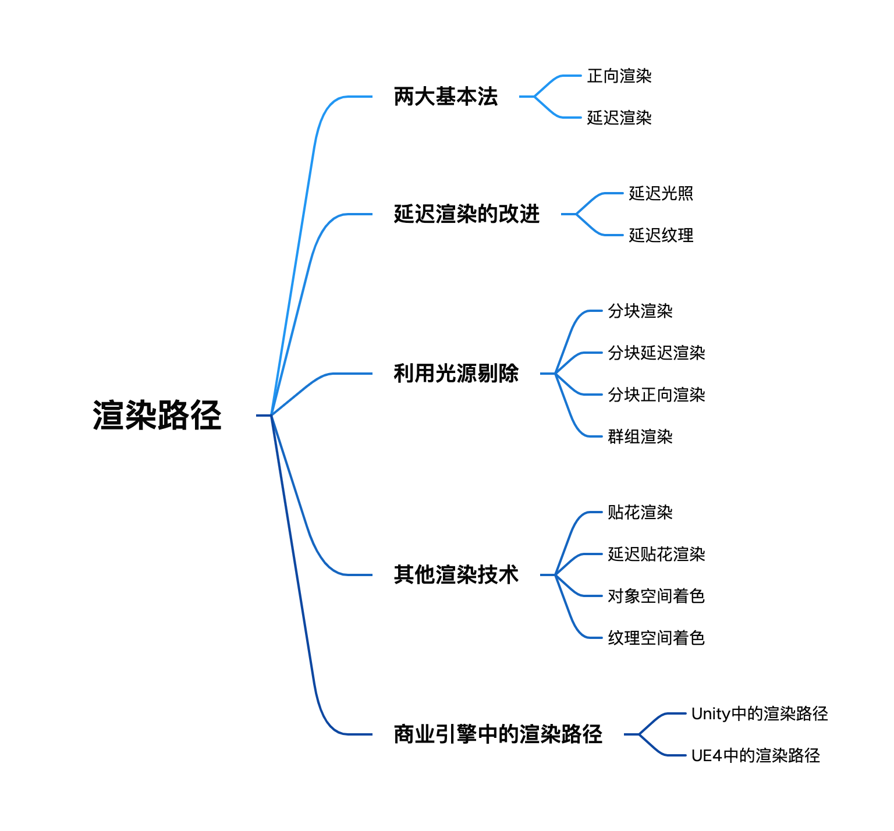
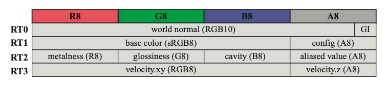
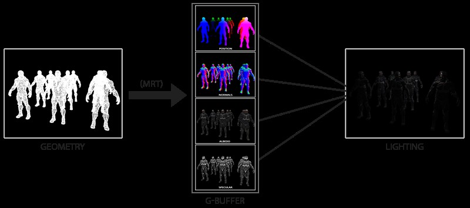
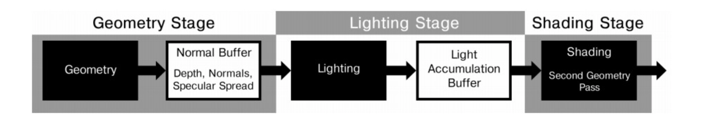
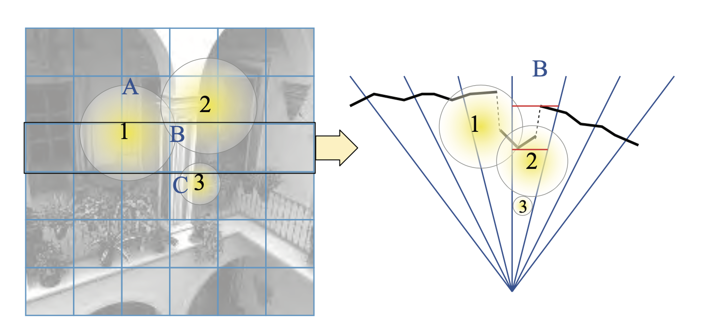
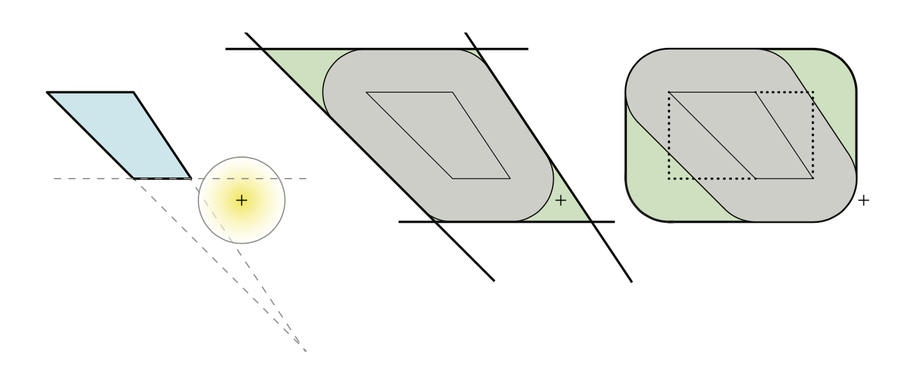
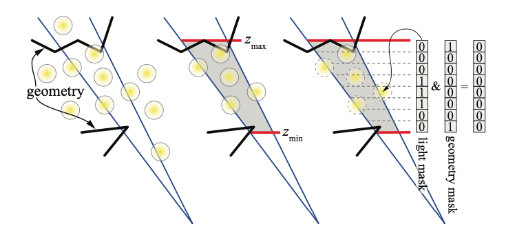
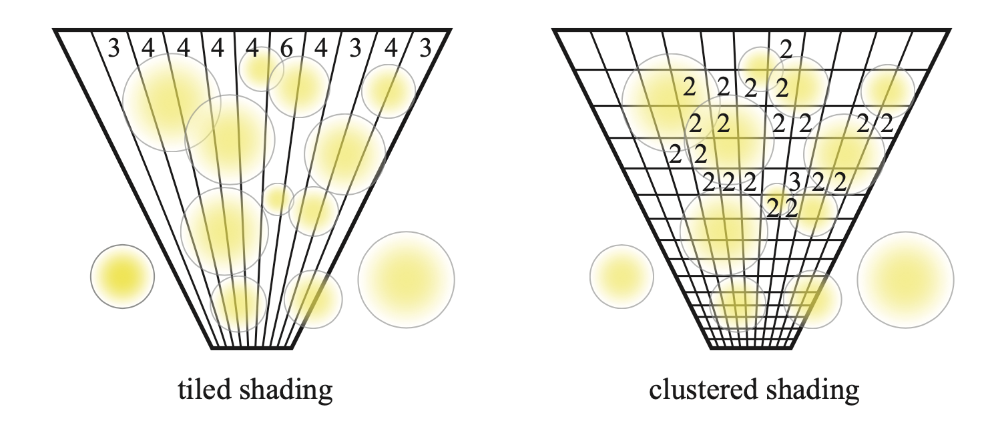
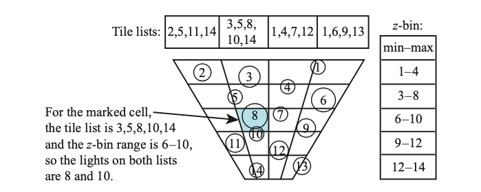
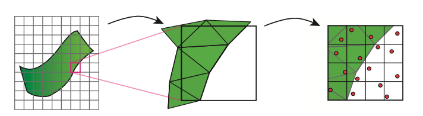

# 图形开发基础（四）渲染路径与常见渲染技术

首先附上本文的内容结构



渲染路径其实指的就是渲染场景中光照的方式。由于场景中的光源可能很多，甚至是动态的光源。所以怎么在速度和效果上达到一个最好的结果确实很困难。以当今的显卡发展为契机，人们才衍生出了这么多的渲染路径来处理各种光照。

以下就来讲讲现在常见的一些渲染路径。

## 正向渲染(Forward Rendering)

首先是最常见的正向渲染。正向渲染在一次渲染当中，需要逐像素或者逐顶点，依次对每一个光源进行光照计算得出最终结果。

每进行一次完整的前向渲染，我们需要渲染该对象的渲染图元，并计算两个缓冲区的信息，分别为颜色缓冲区和深度缓冲区。利用深度缓冲来决定一个片元是否可见，如果可见的话就更新颜色缓冲区中的颜色值。

前向渲染的过程可以用如下伪代码进行描述

```
//遍历模型中的每个基元
for (each primitive in modle) {
    //遍历每个基元中的像素
    for (each fragment covered by primitive) {
        if (failed in depth test) {
            discard;
        } else {
            //对每个光源进行计算
            for (each light) {
                float4 color = Shading(materialInfo, pos, normal, lightDir, viewDir);
                writeFrameBuffer(fragment, color);
            }
        }
    }
}
```

可见正向渲染的复杂度很大程度上会受到光源数目的影响，因此比较适合光源较少的场景。对于一个拥有多光源的场景，正向渲染的效率会变得非常低下。

因此对于这种正向渲染，在Unity中对它进行了一些优化，具体的优化就放在后面的章节，Unity中的渲染路径中进行说明。

## 延迟渲染(Deferred Rendering)

如果说在前向着色中使用z-prepass的方法可以被是为几何渲染和着色的温和解耦，那么延迟渲染就意味着模型的几何计算与光源计算的完全分离。延迟着色的基本思想是在执行任何材质照明计算之前就执行所有可见行测试与表面属性评估，它先将所有的物体都先绘制到屏幕空间的缓冲中，这个缓冲也就是几何缓冲区(G-buffer)，再逐光源对该缓冲区进行着色，从而避免了因计算被深度测试丢失的片元对光源照明的计算而产生的不必要的开销。

### 几何缓冲区(G-Buffer)

那么我们首先来了解一下什么是几何缓冲区。

几何缓冲区用于存储物体的表面属性。他可以用来存储程序员希望它包含的任何内容，也就是完成所需的后续光照计算所需要的任何内容。每个几何缓冲区都是一个单独的渲染目标，在延迟渲染中通常使用三到五个渲染目标组我诶几何缓冲区。更多的渲染目标会增加使用的带宽，因此这也是几何缓冲区的可能的瓶颈之一。下图展示了一种可能的几何缓冲区的布局。



### 延迟渲染过程分析

延迟渲染的过程主要可以分为一下两个阶段，分别为几何处理阶段与光照处理阶段。

在几何处理阶段中，我们获取对象的各种几何信息，并将第二步所需的各种数据储存(也就是渲染)到多个G-buffer中。

在光照处理阶段中，我们只需渲染出一个屏幕大小的二维矩形，使用第一步在G-buffer中存储的数据对此矩阵的每一个片段计算场景的光照。光照计算的过程还是和正向渲染以前一样，只是现在我们需要从对应的G-buffer而不是顶点着色器(和一些uniform变量)那里获取输入变量了。

下图很好的描述了整个延迟渲染的过程



在第一个阶段当中，我们需要将多种不同的几何信息分别渲染到多个渲染目标当中，此时如果使用多重目标渲染(Multiple Render Targets)，我们便可以在一个Pass中完成所有的渲染，这也将大大提升这个阶段的效率。由于在这个阶段中已经经过了深度测试阶段，因此可以保证在每张G-buffer中的信息与最终需要展现在屏幕中的信息是一样的，从而保证了在光照处理阶段当中我们只会对每一个像素进行一次处理，也减少了许多不必要的计算。

以下是一种两个Pass的延迟渲染伪代码

```
Two-pass deferred shading algorithm
Pass 1: geometry pass
- Write visible geometry information to G-buffer
Pass 2: shading pass
For each G-buffer sample, compute shading
- Read G-buffer data for current sample
- Accumulate contribution of all lights
- Output final surface color
```

### 延迟渲染的优点

相比于传统的正向渲染，顶点和像素着色器需要检索每个灯光和材质的参数并计算一个对另一个的影响，正向着色需要一个复杂的顶点和像素着色器来覆盖所有可能的材质和灯光组合。而在延迟渲染中，由于几何计算与灯光计算的分离，使得每个着色器都专注于几何参数提取或者照明。这种分离使着色器的功能进行拆分，简化了着色器系统管理。

并且由于延迟渲染的特点，使它在含有大量光源的场景当中的效率要远远高于正向渲染。因为其复杂度并不会因为光源数目的变化而产生变化。

### 延迟渲染的缺点

延迟渲染也并非毫无缺点，它的两个重要的技术限制在于涉及透明度的渲染以及抗锯齿。

在抗锯齿方面，正向渲染可以非常轻松地使用MSAA，只需要为MSAA存储没像素N个深度和颜色样本。但是在延迟渲染中，将每个元素N个样本存储在G-buffer中会造成非常大的内存开销。

在透明度的渲染方面，由于在计算几何信息的时候已经完成了一次深度测试，但是在G-buffer渲染完成之后，只记录了当前能够看到的像素，而对于透明的物体，同一个像素点可能需要记录更多的信息。因此在延迟渲染中进行透明物体的渲染才用的方案一般是结合正向渲染与延迟渲染两种方案，先用延迟渲染进行不透明物体的渲染，再用正向渲染完成透明物体的渲染。

由于G-buffer的使用，延迟渲染对于内存的占用以及内存带宽的要求非常高，这也是延迟渲染的技术瓶颈之一。

最后，由于在计算光照时所有的网格信息已经全部被转换为了像素信息，这也就意味着我们不能从像素当中去得知这是哪一个几何体，运用了哪一个光照，如果不加以改进，就意味着场景中所有的物体都必须使用相同的光照进行计算。这显然是不太好的，因此便有了如下对延迟渲染中光照计算部分的改进。

### 延迟渲染对于光照计算的改进

作为性能提升的开始，我们可以确定光体积的屏幕边界，在屏幕中绘制出光所覆盖的屏幕空间四边形，从而来减少像素的处理。我们甚至还可以使用第三个屏幕维度，也就是z-depth。通过绘制包含光源体积的粗糙球体网格，可以对光源的计算区域进行进一步修剪。如果球体在深度缓冲区被隐藏，则灯光的体积位于最近的表面后面，因此无法产生效果。通过这种方式，可以有效减少在光照处理阶段中对于光照的计算。

## 延迟光照

延迟光照(Deferred Lighting/Light Pre-Pass)是为了解决延迟渲染中使用G-buffer而产生的大量的开销而出现。相较于延迟渲染将整个渲染过程分为几何渲染与光照渲染两个部分，延迟光照则将整个过程分成了三部分，第一部分依旧是渲染场景中的几何体，将几何体的z值与normal值存入G-buffer。第二部分则是利用第一部分存下的G-buffer来进行光照的渲染。将漫反射与镜面反射信息写入不同的漫反射和镜面反射累积缓冲区。第三部分再次对几何体进行渲染，直接从纹理中获取漫反射与镜面反射的值，计算出最终的颜色值写入最终的颜色缓冲区，一次来完成一次完整的渲染。

整个渲染过程如下图所示



相对于传统的延迟渲染，使用延迟光照可以对每个不同的几何体使用不同的着色器进行渲染，所以每个物体的材质属性将有更多变化。之所以能够在延迟光照中对每个几何体运用不同的着色器，主要原因在于在其渲染的第三步其实依旧相当于一个正向渲染的过程。因此，从某种意义上延迟光照也能享受一部分正向渲染所带来的优势。

## 延迟纹理

延迟纹理(Deferred Texturing)的思想是，在延迟渲染中，与其渲染出包含渲染所需要的所有信息的G-buffer，不如直接渲染出一张可见像素纹理，其中包含几何体基元的ID，UV以及贴图ID。并在延迟渲染的过程中根据这些信息对相应的纹理进行采样。使用这种方式可以节省掉原本使用G-buffer产生的大量内存带宽，并且避免了一部分过度绘制。

这样做的另一个好处是，虽然GPU的计算能力和带宽能力都在随着时间的推移而提高，但是它们以不同的速度增长，计算速度比带宽速度增长的更快，因此把系统的瓶颈定位在GPU的计算能力而不是缓冲区的访问能力上是一种相对而言更好的选择。

## 分块渲染

分块渲染(Tiled Rendering)的核心思想是将屏幕分为一个个细小的图块，然后将光源分配给每一个块，从而限制在每一个块中评估的灯光数量以及所需要的工作量和存储量。然后在单个着色器调用中访问每一个图块的灯光列表，而不是像延迟渲染一样在每个像素中都调用所有的光源进行计算。

那么我们该如何对光源进行分块呢。这个计算又被称为光源剔除(light culling)。这个过程可以在CPU中计算也可以在GPU中使用计算着色器进行计算。光源剔除的原理如下图所示



为了确定光源是否影响某个图块，一般将图块所在的视锥体与光源进行相交测试。测试中的两个物体可以分别看作是一个细长的截锥体与一个球体。然而截锥体通常又长又薄且不对称，会使得剔除得准确度并不那么高。针对这个问题，很多方案提出了更加准确得剔除方案，比如结合深度算出当前图块的AABB，然后基于AABB和球体做相交测试。

下图展示了基于视锥体得剔除方案对于光源的误判以及利用包围盒对剔除方案的改进



其中左图表示仅使用视锥体进行相交测试，将光源误判成有影响的光源。而中图对图块进行扩张，最后在右图利用包围盒来剔除这个光源。

除此之外，还有一种更为精细的剔除算法，称为2.5D剔除算法。其原理是将每个图块的深度范围zmin和zmax沿着深度方向分成n个单元。如下图所示



在分成n个单元之后，创建一个n位的几何掩码，并在有几何的地方每个位都设置位1，随后对所有光源进行迭代，并用相同的原理创建一个光源掩码。光源掩码表示在哪些格子中包含光源，几何掩码表示在哪些格子中包含几何物体。将这两个掩码进行与运算，结果为1的位则代表该格子中同时具有光源与几何物体，即代表光源会对几何物体造成影响。

分块渲染带来了诸多的优势，例如着色器代码可以分解出渲染方程中的任何常用项，并只计算一次，而不是按光源数量进行计算。图块中的每一个片段都会执行相同的光照计算，保证了GPU的连续执行。在渲染不透明的对象之后，可以使用正向渲染来进行不透明物体的渲染，并使用相同的光照计算。以及所有的光照计算能够在一个Pass中完成。

分块渲染的思想可以运用到正向渲染中也可以运用到延迟渲染当中，当它被运用到这两种不同的渲染路径中时，也分别诞生了两种新的渲染方式，分别为分块延迟渲染以及分块正向渲染。以下便对这两种方式分别进行说明。

## 分块延迟渲染

在延迟渲染当中，在进行光源计算时，每一个光源的计算都要对G-buffer进行读取，因此在大量光源的情况下，会对同一个像素的G-buffer进行大量重复读取，计算之后以相加的方式写入颜色缓冲。因此对G-buffer的读写所造成的大量的内存带宽的使用就成为了延迟渲染的一个瓶颈。而分块延迟渲染(Tile-Based Deferred Rendering)的出现正好对这种情况做出了优化。

由于在计算每一个图块收到哪些光源影响的时候，已经将受影响的光源的索引存储在了光源列表当中，因此在进行着色时，每像素都只需要进行一次G-buffer的访问与一次颜色缓冲的写入。大幅降低了内存带宽的使用量。

## 分块正向渲染

当然，分块渲染的思路也可以运用在正向渲染当中。在这种渲染方式中，首先需要对几何体进行z-prepass以避免在最终通道中过度绘制，并进行进一步的光源剔除。计算着色器依旧按照图块对灯光进行分类，接着在执行前向着色，每个着色器根据图块在屏幕中的位置访问灯光列表。

通常来讲分块正向渲染(Tiled Forward Rendering/Forward+)的渲染速度就比TBDR更快。Forward+更像是一种集合了各种渲染路径优势的渲染方式，它支持复杂的材质，支持硬件抗锯齿，带宽的利用率高并且支持透明物体的渲染，用一句话总结就是它能够获得所有正向渲染所带来的优势，但是又在光照的计算当中降低了开销。

## 群组渲染

群组渲染(Clustered Rendering)的主要思路也是对光源进行剔除，可以看做是分块渲染的一个升级版。分块渲染的思路是对每一个图块进行光源剔除，而群组渲染的思路则更加简单粗暴，在分块渲染的基础上，在深度方向也进行多次分层。最终把这个视锥体切分成了一个一个小块，如下图所示



虚幻引擎的群组渲染将画面分成相同大小的图块，并将深度方向的视锥体分成了32个切片，最后分别计算每一个小块中包含多少有影响的光源。

群组渲染的方法依旧可以被应用于正向渲染路径和延迟渲染路径。但是与分块渲染不同的是，群组渲染在对光源进行剔除时，并不需要使用任何的物体几何信息。

另一种光源的存储方式叫做z-binning。利用这种方式存储和访问光源列表会大大减少内存和带宽的使用。它的原理在于先将光源按照深度进行排序，并根据这些深度为每一个光源标记一个ID。然后使用一组深度切片对光源进行分组，每一个深度切片当中值存储影响这个切片的光源的最大和最小的ID。再接着生成一个图块列表，图块列表中标记了这个视锥体切片中对这个图块有影响的所有光源。就相当于不直接存储每一个小块当中产生影响的光源，而是记录这个小块的两个维度的值从而能够轻易计算出这个小块当中的光源有哪些。如下图所示



使用这种方式有可能会对光源进行错误分类，但是一般对于人造环境，xy屏幕坐标和z深度中的光源通常很少产生重叠。

## 贴花渲染

贴花渲染(Decal Rendering)是3D世界中动态生成细节的一种常用方法。贴花常用于制作子弹孔、血迹、轮胎痕迹以及其它相似的项作为游戏中发生的事件。它们也可以用于设计师使用位于墙上的污迹、破损效果的纹理来丰富场景。

贴花可以通过多种方式与底层材料混合，它可鞥会改变底层的颜色，也可能会改变凹凸贴图，可以定义完全不同的材料。多个贴花可能运用于同一个几何体，也可能一个贴花就跨越多个模型。这些变化对于正向渲染和延迟渲染系统对于如何存储和处理贴花都会产生影响。

相比于正向渲染，延迟渲染无需处理对每一个贴花进行光照计算。贴花的效果可以直接应用于G-buffer，并稍后在进行光照计算时，直接在G-buffer中找到对应的数据进行光源着色，因此避免了在正向着色中发生的过度绘制。因此延迟渲染比正向渲染更擅长处理贴花。因此以下主要对延迟贴花渲染进行讨论。

## 延迟贴花渲染

作为一个好的贴花系统，需要解决如下几个问题：

1. 贴花系统需要和光照很好地结合起来。贴花不仅要能改变颜色，也需要能够改变法线，高光因子，以及其它表面参数，使它们和其它几何体变得无明显区别。

2. 贴花应该能应用在所有表面上，包括静态和动态的。

3. 贴花能够根据几何包围体进行合适的裁剪，甚至能够环绕角落。

4. 对于和应用于碰撞检测的几何体有着很大差异的几何体，贴花系统需要能够生效。

对于第一个问题，延迟渲染系统很容易就能解决，因为这些所有的改变都会在进行光源计算之前被存储到G-buffer当中。对于第二个问题，如果我们能够在G-Buffer中占用一个8位通道，那么这个问题也很容易解决。而后面两个问题，可能才是问题真正的开始。

延迟贴花(Deffered Decal Rendering)的基本思路是在绘制贴花时，将其绘制在一个立方体或者球体的实体上，利用G-buffer中的信息来完成计算。比如我们在绘制贴花时，获取G-buffer存储的深度，法线等信息，也就是获取在绘制贴花的实体背后的物体的信息，而并非绘制贴花的实体的信息，通过这种方式，就能够保证绘制的贴花在视觉上是贴在背后的物体上，而不是贴在一个单独的立方体或球体上面。

但是，当遇到贴花的z轴与表面平行的情况时，则会发生贴花被拉伸的情况，此时采取的办法则是在z轴与表面法向量接近垂直的情况，对贴花做一次翻转来进行矫正，或者直接根据z轴的坐标值来设置贴花的淡出参数来达到一个合适的视觉效果。

## 对象空间着色

对象空间着色(Object-Space Shading)的关键概念是微多边形，它的基本思路是将物体的每个表面切为极小的四边形网格，将微多边形使用一中颜色来进行着色。这种技术最终演变为对微多边形网格中的顶点进行着色。对此，每个微多边形被插入到一个抖动的4*4的样本网格中的一个像素，这个像素是一个超采样的z缓冲区，而抖动是为了通过产生噪声来避免混叠。如此一来，因为着色发生在微多边形的覆盖范围内，所以这个过程在光栅化之前。这种类型的技术被称为基于对象的着色。具体的过程可以参考下图



在图中，每个对象都被分为细小的微多边形，然后单独着色，与每个像素的抖动样本进行比较，最终结果用于渲染图像。

在对象空间中着色的优势之一是材质纹理通常与其微多边形直接相关。也就是说，可以细分几何对象，使得每个微多边形中有2的幂次方数量的纹素。在着色期间，可以为微多边形检索精确的过滤mipmap样本，因为它与着色的表面积直接相关。

运动模糊和景深效果也适用于这种类型的排列。对于运动模糊，每个微多边形在帧间隔期间的抖动时间沿其路径分配一个位置。因此，每个微多边形将在移动方向上具有不同的位置，从而产生模糊效果。景深以类似的方式实现，基于弥散圆分布微多边形。

该算法也有一些缺点，他必须保证所有对象能够镶嵌且被精细分割。着色发生在z缓冲区中的遮挡测试之前，因此可能会因为过度绘制而被浪费。

## 纹理空间着色

纹理空间着色(Texture-Space Shading)的主要思路是测试每个三角形的视锥体和背面剔除，然后将其绘制的表面应用于输出目标的相应区域，根据其(u,v)参数化对该三角形进行着色。同时，使用几何着色器，计算相机视图中每个可见三角形的大小。此大小值用于确定三角形插入的类似mipmap的级别。这样，对象执行的着色量与其屏幕覆盖范围有关。最后使用随机光栅化来渲染最终图像。生成的每个片段从纹理中查找其阴影颜色。同样，计算出的阴影值可以重新用于运动模糊和景深效果。

## Unity中的渲染路径

到这儿为止，我们已经了解了常见的渲染路径以及一些增加渲染效率的常见渲染技巧，并明白了它们之间能够按照需要进行自由组合。那么现在就来看看在商业引擎当中使用了哪些渲染路径。

Unity支持多种类型的渲染路径，在5.0版本之前，主要有3中渲染路径，分别为正向渲染，延迟渲染以及顶点照明渲染。在5.0之后，Unity抛弃了顶点照明渲染路径，并用新的延迟渲染路径来替代了旧的延迟渲染路径。以下我们根据渲染路径的类别来进行一一比较。

### Unity中的正向渲染

Unity中的正向渲染有3中处理光照的方式，分别为逐顶点处理，逐像素处理以及球谐函数处理。而决定哪一个光源按照使用那种处理模式取决于光源的类型和渲染模式。光源的类型指的是该光源是平行光或者其他类型的光，渲染模式则指的是该光源是否被指定为重要光源。

在一般情况下，我们渲染一个物体时，Unity会根据场景中各个光源的设置以及这些光源对于物体的影响程度对光源进行一个重要度排序，其中一定数目的光源会按逐像素进行处理，然后最多有4个光源按逐顶点进行处理，剩余的光源都按照球谐函数的方式进行处理。

这其中，场景中最亮的平行光总是会按照逐像素的方式进行处理，渲染模式被设置为不重要的光源会按照逐顶点或者球谐函数的方式进行处理，渲染模式为重要的光源会按照逐像素的方式进行处理。并且，如果以上规则得到的逐像素光源数量小于质量设定中逐像素光源数量，则会有更多光源按逐像素的方式进行处理。

在正向渲染中一共包含两种Pass，Base Pass和Additional Pass。Base Pass只会被执行一次，用于计算光照纹理，环境光，自发光，阴影等效果。而Additional Pass则能够被执行多次，并且默认情况下不支持阴影，但是能够通过使用宏指令来开启阴影。Additional Pass会根据影响物体的其他逐像素光源数目被多次调用。

### Unity中的顶点照明渲染

顶点照明渲染是对硬件配置要求最少，运算性能最高，同时效果也是最差的一种渲染路径。它可以被视为正向渲染的一个子集，因为它只能通过逐顶点的方式去计算光照，这也就意味着我们无法使用一些逐像素光照变量。顶点照明渲染在5.0以后的版本中作为一种被遗留的渲染路径存在，将来也有被移除的可能。

### Unity中的延迟渲染

Unity中的新旧延迟渲染系统的差别非常小，只是是用来不同的技术来权衡不同的需求。

其中包含两个Pass，第一个Pass用于渲染G缓冲，在这个Pass中会把物体的漫反射颜色，高光反射颜色，平滑度，法线，自发光和深度等信息渲染到屏幕空间的G缓冲中，对于每个物体来说这个Pass只会被执行一次。

第二个Pass用于计算真正的光照模型，这个Pass会使用上一个Pass中渲染的数据来计算最终光照的颜色，再存储到帧缓冲中。

## UE4中的渲染路径

UE4中采用的渲染路径是延迟渲染。其中主要包含三个主要的Pass，分别为PrePass，Base Pass以及Lighting。

在PrePass中，主要将物体的深度写入深度缓冲区，接着在Base Pass中利用深度缓冲区中的深度信息来进行像素剔除。并且渲染不透明和Mask材质，将信息写入G-buffer。最后，在Lighting阶段进行光照着色计算，完成整个渲染。

UE4的整个渲染流程非常庞大，篇幅限制因此不在这里一次性给出详尽的解释，只是对其所使用的渲染路径做一个简单的说明。

本文只是对一些常见渲染路径或是渲染技术的简单介绍，主要是为了自己能够这次的学习中梳理出一个比较清晰的学习大纲，了解每一种方法或是技术之间的关系以及一些优劣对比，以方便后续的学习。