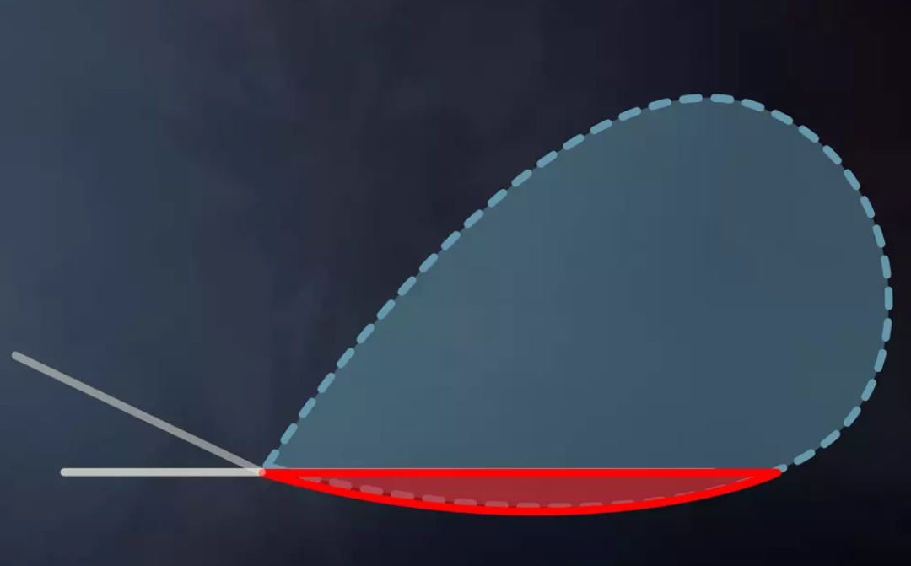

# 随机屏幕空间反射 Stochastic Screen-Space Reflections (SSSR)

目前主流的反射效果实现方式，都是通过屏幕空间来进行实现，也就是SSR(Screen Space Refletions)。SSR在消耗低廉性能的同时，能够带来相对不错的反射效果，同时该反射效果的实现又不会因为场景的复杂程度而影响，对于延迟渲染而言非常友好。那么先来看看传统的SSR是如何实现的。

## 传统屏幕空间反射 SSR

传统SSR实现步骤非常简单，主要分为以下几步：

1. 根据GBuffer和Depth重建场景的世界坐标。
2. 从GBuffer发射射线，射线方向根据View向量与Normal求得
3. 使用RayMarching找到反射向量与深度图的交点，如果击中，该点就是该像素点的反射结果。

可以发现SSR存在以下几个缺点：

1. 场景根据Scene Buffer进行重建，也就是只能反射屏幕中存在的东西。
2. 每一个点的反射都是精确无比的，只能够用来模拟镜面反射，而无法实现例如带有粗糙度的金属质感的模拟。


使用UE进行SSR效果的模拟，可以很明显地看到，盒子底面在屏幕中无法看到，因此在反射中也无法进行呈现。

## 对SSR的改进需求

为了更好地模拟各种材质的反射表现，EA在使用寒霜引擎制作镜之边缘的时候，提出了以下几个改进需求

- Sharp and blurry reflections 支持清晰和模糊的反射
- Conteact hardening 越接近表面反射越锐利
- Specular elongation 高光的拉伸
- Per-Pixel roughness and normal 能够逐像素处理法线和粗糙度

于是，他们在Siggraph2015中提出了 Stochastic Screen-Space Reflections 算法来解决上述问题。

## Stochastic Screen-Space Reflections 核心原理

该算法的流程图如下所示


1. Tile classification 网格划分

这一步是通过将屏幕分为多个Tile，在1/8的分辨率下向每个Tile发射射线，根据射线击中信息来判断该Tile的重要性，从而决定这个Tile中的像素需要发射多少射线。

这一步通过分块思想，能够在一定程度上减少射线求交的开销。

2. Ray allocation 射线分配

这一步通过射线与Tile交点的粗糙度来判断应该向这个Tile来发射何种射线。射线根据开销大小被分为两种，开销昂贵的射线在求交时使用Hierarchical Raytracing，也就是通过通常所说的Hi-Z Buffer来进行射线求交，求出精确的交点，而廉价的射线则使用普通的Linear March来进行求交，根据步进大小也可能会跳过屏幕中的微小物体。

这一步通过对粗糙度的划分，更近一步减小了射线求交在算法中的开销。因为粗糙度更大的材质表面或许并不需要过于精确的反射结果。

对于Hierarchical Raytracing，简单来说就是用射线打向Hi-Z Buffer(以下简称为HZB)，如果没有击中，则增加步进的同时使用HZB的下一级Mip再次进行求交，重复该过程直到相交，相交之后降低Mip等级再进行更精细的查找，这一步有种二分法求解的味道。

该算法的伪代码非常简单，这里也一并列出

```cpp
mipLevel = 0;
while (mipLevel > -1)
    step through current cell;
    if(above Z plane) ++mipLevel;
    if(below Z plane) --mipLevel;
```

下图就是该算法的执行过程


3. Importance sampling refresher 重要性采样

上一步决定了发射的射线采用那种方式进行求交，那么该如何决定射线方向呢，便是使用重要性采样的方式来进行决定。

重要性采样时蒙特卡洛积分中用于减少方差的算法，结论可以简单总结为，当重要性采样中使用的概率密度分布函数(PDF)越接近目标函数，则最终的计算结果则更为接近实际值。

因此在这一步中所需要做的，就是选择一个合适的PDF来进行采样。

由于目前主流PBR渲染中的BRDF都采用GGX函数，因此重要性采样的PDF可以选择使用GGX相关的函数来进行计算。使用PDF来进行射线方向生成时，会有生成的射线方向向地下发射，遇到这种情况便将其舍弃重新生成。如下图所示



4. Ray reuse 射线复用

到此为止已经决定了某个像素点需要发射的射线方向，也已经决定了该射线使用何种方式来与深度进行求交。为了更进一步做到射线的高效率使用，算法提出了射线复用的思想。

邻近像素的可见性可能是不同的，但是如果假设他们相同，我们便可以复用邻近像素的结果来进一步提升采样率。但是根据重要性采样的结果，邻近像素的BRDF的差距可能非常大，因此可能带来巨大的方差，导致结果变得更差。

$$ \int f(x)dx=\lim_{N\rightarrow\infty}\frac{1}{N}\sum^N_{k=1}\frac{f(x_k)}{p_k} $$

在这个式子中，$ f(x_k) $ 代表该像素的BRDF，$ p_k $ 代表PDF。可以发现积分结果的差异主要来自于BRDF。

既然如此，回到问题的最初，反射是在解决一个什么样的问题？

人眼通过反射看到一个物体，就意味着物体发射了无数条光线进入人眼，进入人眼的光线可以看作是这无数条反射光线进行积分后的总和。于是有了如下这个能量守恒的式子。

$$ L_o = \int L_i(l)f_s(l\rightarrow v)cos\theta_ldl $$

其中 $ L_i $ 代表入射辐射率，$ f_s $ 代表BRDF。通过重要性采样之后，该式子可以写成蒙特卡洛积分的形式

$$ L_o = \lim_{N\rightarrow\infty}\frac{1}{N}\sum^N_{k=1}\frac{L_i(l_k)f_s(l_k\rightarrow v)cos\theta_{l_k}}{p_k} $$

可见该式子的方差，主要来自于这一部分

$$ \frac{f_s(l_k\rightarrow v)cos\theta_{l_k}}{p_k} $$

在上述不定积分的式子中同除同乘带来方差的项可得

$$ L_o = \frac{\int L_i(l)f_s(l\rightarrow v)cos\theta_ldl}{\int f_s(l\rightarrow v)cos\theta_ldl}\int f_s(l\rightarrow v)cos\theta_ldl $$

可以发现，同乘除的这一项的物理意义可以理解为反射BRDF的积分，又可近似看作是IBL中的反射项，因此该式子可以写成

$$ L_o \approx \frac{\int L_i(l)f_s(l\rightarrow v)cos\theta_ldl}{\int f_s(l\rightarrow v)cos\theta_ldl}FG $$

再写成蒙特卡洛积分形式

$$ L_o \approx \frac{\sum^N_{k=1}\frac{L_i(l_k)f_s(l_k\rightarrow v)cos\theta_{l_k}}{p_k}}{\sum^N_{k=1}\frac{f_s(l_k\rightarrow v)cos\theta_{l_k}}{p_k}}FG $$

在这个最终的式子中，分子可以看作是BRDF加权图像的贡献，分子是归一化的BRDF权重，FG则是BRDF的预积分项。这么解释可能比较生硬，还是直接来看伪代码

```cpp
result = 0.0
weightSum = 0.0
for pixel in neighborhood:
  weight = localBRDF(pixel.hit) / pixel.hitPDF
  result += color(pixel.hit) * weight
  weightSum += weight
result /= weightSum
```

## 优化方案

作者在提出算法的同时，也提出了几个优化方案

1. Sparse raytracing

    生成RT时使用低分辨率，在发射射线求解时使用全分辨率。能够减少非常多噪点。

2. Temporal reprojection

    将光线投射到上一帧的Depth会产生拖影，因此取平均的Depth来进行计算，在时序上进行光线的复用。

3. Importance sampling bias

    在生成随机数时进行截断，去掉PDF的拖尾，从而减少噪点产生。

4. Filtered importance sampling

    对Color Buffer生成Mip，来模拟Cone Tracing。

5. Multi-pixel resolve

    同时对对条射线进行求解。

## UE5中的SSR实现

UE中的SSR实现主要包含在两个Pass中

1. ScreenSpaceReflection

2. DiffuseIndirectComposite

SSR的主要计算都包含在第一个Pass，第二个Pass的主要工作则是采样SSRT并进行合成。SSRT的生成代码主要在SSRTReflections.usf文件中的ScreenSpaceReflections函数。主要步骤与上述所讲大致相同，只是UE在挑选计算射线权重使用的函数时并未选择了普通的加权平均，并在合成阶段使用EnvBRDF进行合成，以节省性能。UE中的代码和注释如下

```cpp
BRANCH if( bHit )
{
  ClosestHitDistanceSqr = min(ClosestHitDistanceSqr, ComputeRayHitSqrDistance(PositionTranslatedWorld, HitUVz));

  float2 SampleUV;
  float Vignette;
  ReprojectHit(PrevScreenPositionScaleBias, GBufferVelocityTexture, GBufferVelocityTextureSampler, HitUVz, SampleUV, Vignette);

  float4 SampleColor = SampleScreenColor( SceneColor, SceneColorSampler, SampleUV ) * Vignette;

  SampleColor.rgb *= rcp( 1 + Luminance(SampleColor.rgb) );

  // Correct integration applies DGF below but for speed we apply EnvBRDF later when compositing
#if 0
  // CosineSampleHemisphere
  // PDF = NoL / PI,
  SampleColor.rgb *= F * (D * Vis * PI);
#elif 0
  // ImportanceSampleGGX
  // PDF = D * NoH / (4 * VoH),
  SampleColor.rgb *= F * ( NoL * Vis * (4 * VoH / NoH) );
#elif 0
  // ImportanceSampleVisibleGGX
  // PDF = G_SmithV * VoH * D / NoV / (4 * VoH)
  // PDF = G_SmithV * D / (4 * NoV);
  SampleColor.rgb *= F * G_SmithL;
#endif

  OutColor += SampleColor;
}
```

UE的实现显然并没有将论文中的观点实现的面面俱到，为了效果或者为了性能都有更多的改进工作可以进行，然而这也是后话了，毕竟UE中的坑实在是太多了。这次就先这样子吧。


