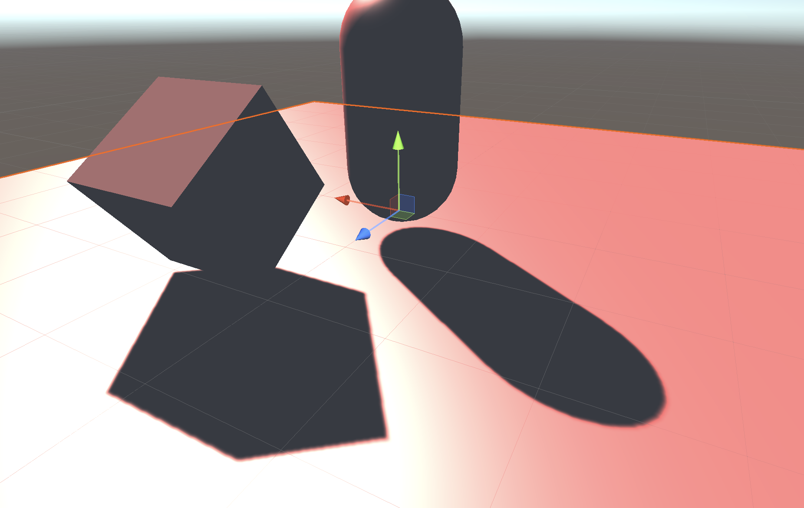

# Unity阴影渲染实现（一）--Unity宏阴影

这段时间使用Unity把阴影自己尝试着实现了一下。原理讲起来不难，但是在实现过程中还是踩了不少的坑。下面就让我把这段时间遇到的坑以及整个实现的过程都记录一下。本来是打算用最近在写的一个Vulkan渲染器去实现的，结果由于进度太慢连RHI都还没有封装完，想了想还是先用Unity搞一下好了。果然学习还是要一步一步慢慢来。那废话也不多说了，就开始吧。

既然是Unity的阴影，首先不得不提的就是Unity自带的用来渲染阴影的三个宏，分别是`SHADOW_COORDS`, `TRANSFER_SHADOW`以及`SHADOW_ATTENUATION`。

`SHADOW_COORDS`用于声明一个用于对阴影纹理采样的坐标，使用方法也非常简单，直接写在`v2f`的结构体里面就可以了，例如

```c
struct v2f {
    //其他属性的声明
    ...

    //声明阴影纹理坐标
    SHADOW_COORDS(2)
};
```

`TRANSFER_SHADOW`的实现会根据平台的不同而不同。如果当前平台支持屏幕空间的阴影映射，则会通过调用内置的`ComputeScreenPos`函数来计算`_ShadowCoord`，如果不支持屏幕空间的阴影映射，就会使用传统的阴影映射技术，通过把定点坐标从模型空间变换到光源空间，然后存储到`_ShadowCoord`中。如果我们在`v2f`结构体中使用了`SHADOW_COORDS`，只需要再在顶点着色器中直接使用`TRANSFER_SHADOW`即可

```c
v2f vert(a2v v) {
    v2f o;
    //其他属性值的计算
    ...
    
    //转换纹理坐标
    TRANSFER_SHADOW(o);
    
    return o;
}
```

`SHADOW_ATTENUATION`负责使用`_ShadowCoord`对阴影相关的纹理进行采样得到阴影信息。这句宏也是直接在片元着色器中直接使用即可

```c
fixed4 frag(v2f i) : SV_Target {
    //物体表面光照计算
    ...
    
    //使用内置宏对阴影进行采样
    fixed shadow = SHADOW_ATTENUATION(i);

    return fixed4(ambient + (diffuse + specular) * atten * shadow, 1.0);
}
```

当然，既然是宏，在使用的时候对命名也会有一些要求。为了使这些宏正确工作，需要保证`a2v`结构体中的顶点坐标命名必须为`vertex`， 顶点着色器的输入结构体`a2v`必须命名为`v`，`v2f`中的顶点位置变量必须命名为`pos`。

最后我们只需要在Unity编辑器当中，对想要投射阴影对物体开启`Cast Shadow`选项，对接收阴影的平面开启`Receive Shadows`选项就能渲染出阴影了。效果大概长这样子



但仅仅是这样子的话，我们自己好像啥也没有做，那么下一篇，就让我们来实现一个自定义阴影。