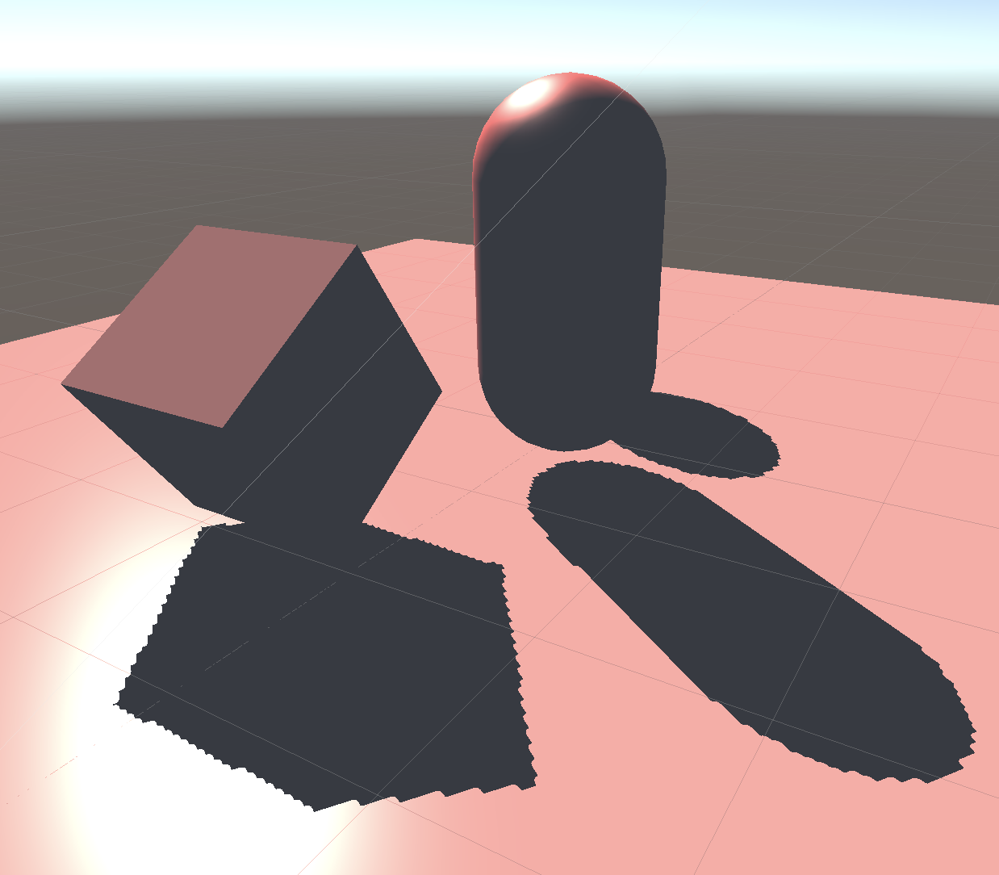
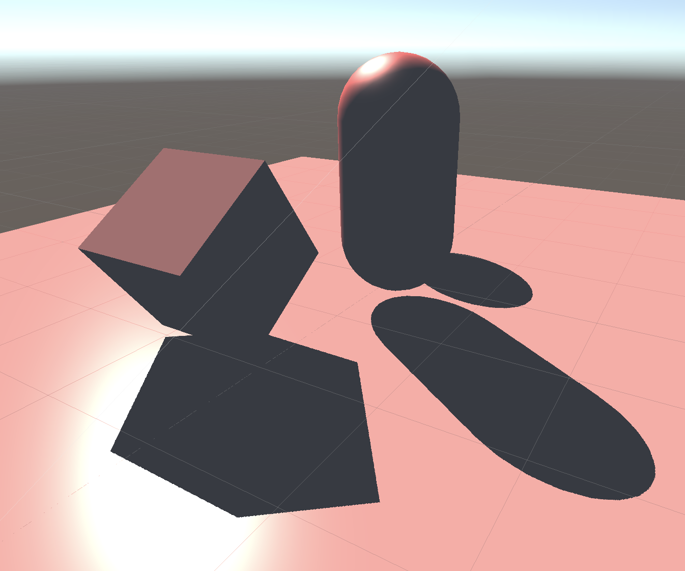

# Unity阴影渲染实现（二）——— Unity自定义阴影

这篇我们不借助Unity宏，来写一个自定义的阴影。没有了Unity宏的帮助，首先必须自己生成一张深度贴图。要生成一张深度贴图，大概分为以下几步：

1. 场景中有一个光源，在脚本中获取光源的位置，在对应位置生成一个相机，然后初始化相机。
2. 创建一张新的纹理，来当作相机的渲染目标。
3. 写一个Shader专门用于这次光源相机的渲染，用于生成一张深度贴图。
4. 调用`Camera`的`Render`方法来进行渲染。

这四个步骤就是生成一张深度贴图的流程，我们只需要在Unity调用物体的渲染流程之前把这个过程执行完成即可。这一部分没什么特别需要注意的地方，直接贴关键代码吧。

```cs
//创建相机与纹理
_lightCamera = CreateLightCamera();
_texture = CreateTexture((int) shadowResolution);

//将相机的目标纹理设置为我们刚创建好的纹理
_lightCamera.targetTexture = _texture;

//将光源的位置参数给到相机，是相机与光源在同一位置
var cameraTransform = _lightCamera.transform;
var lightTransform = dirLight.gameObject.transform;

cameraTransform.position = lightTransform.position;
cameraTransform.rotation = lightTransform.rotation;
cameraTransform.localScale = lightTransform.localScale;

//调用深度贴图的着色器来进行一次渲染
_lightCamera.RenderWithShader(depthTextureShader, "");

//将渲染好的深度纹理传递给阴影着色器即可
Shader.SetGlobalTexture("_shadowMapTexture", _texture);
//将光源相机的VP矩阵传递给着色器，用于后面将物体从世界坐标转换到光源相机的裁剪坐标当中，来生成shadowCoord
Matrix4x4 projectionMatrix = GL.GetGPUProjectionMatrix(_lightCamera.projectionMatrix, false);
Matrix4x4 viewMatrix = _lightCamera.worldToCameraMatrix;
Shader.SetGlobalMatrix(WorldToShadowID, projectionMatrix * viewMatrix);
```

接着是渲染深度贴图的着色器的代码，需要注意的是这边为了使深度的精度更高，在存取深度值的时候把深度值编码为`RGBA`4通道进行存储，从而获得更高的精度。

```c
v2f vert(a2v v)
{
    v2f o;
    o.position = UnityObjectToClipPos(v.vertex);
    return o;
}

fixed4 frag(v2f i) : SV_Target
{
    float depth = i.position.z / i.position.w;

    //根据不同平台对深度值归一化
    #if defined(SHADER_TARGET_GLSL)
        depth = depth * 0.5 + 0.5;
    #elif defined(UNITY_REVERSED_Z)
        depth = 1 - depth;
    #endif
    
    return EncodeFloatRGBA(depth);
}
```

到这一步我们的深度贴图就已经处理完成了，现在应该拿着这张阴影贴图去生成阴影了。此时我们无需再关心脚本这边代码的编写，只需要专注与阴影着色器的编写就可以了。

在阴影着色器的`v2f`结构体中，这次需要手动声明`shadowCoord`属性，来存储对阴影采样的纹理坐标。而`shadowCoord`的计算也十分简单，这里就直接贴代码吧

```c
v2f vert(a2v v)
{
    v2f o;
    //其他属性的计算
    ...

    //阴影采样坐标的计算
    //1. 从物体坐标系转到世界坐标系
    o.worldPos = mul(unity_ObjectToWorld, v.vertex);
    //2. 从世界坐标系转到光源相机坐标系。_worldToShadow就是刚传进来的光源相机的VP矩阵的乘积
    o.shadowCoord = mul(_worldToShadow, o.worldPos);
}
```               

现在有了在光源空间的`shadowCoord`，但是需要注意的是，这里计算出来的`shadowCoord`依然是在光源相机裁剪坐标系下面的值，也就是说它的范围现在是`[-1, 1]`，如果要对纹理进行采样，我们还得把它转换成范围值为`[0, 1]`的uv坐标。

```c
float2 uv = i.shadowCoord.xy / i.shadowCoord.w;
uv = uv * 0.5 + 0.5;
```

uv的计算完成之后，还需要通过`shadowCoord`的`z`值来计算现在从接收平面的像素点到光源的真正深度。

```c
float depth = i.shadowCoord.z / i.shadowCoord.w;
#if defined(SHADER_TARGET_GLSL)
    depth = depth * 0.5 + 0.5;    
#elif defined(UNITY_REVERSED_Z)
    depth = 1 - depth;      
#endif
```

现在使用刚刚计算的uv坐标对深度贴图进行采样，再与真正的深度值进行对比，就可以计算得到阴影值了。再在判断过程中加上阴影的偏移值，就更舒服了。

```c
float hardShadow(float depth, float2 uv)
{
    float4 orignDepth = tex2D(_shadowMapTexture, uv);
    float sampleDepth = DecodeFloatRGBA(orignDepth);
    return (sampleDepth + _shadowBias) < depth ? _shadowStrength : 1;
}
```

这里分别展示一张阴影贴图在高分辨率与低分辨率下的阴影效果图





这里可以看到在低分辨率下的阴影有非常大的锯齿，效果非常不好。但是让我惊讶的是我在低分辨率的阴影贴图下各种调整光照的方向，试了好久都没有试出阴影失真的现象，这点令我非常不解。期间我尝试改变了深度贴图的存储精度，光照方向等等参数都没有试出来阴影失真应该产生的条纹。

那么为了解决锯齿问题，下一篇就让我们来实现PCF解决这个问题吧。