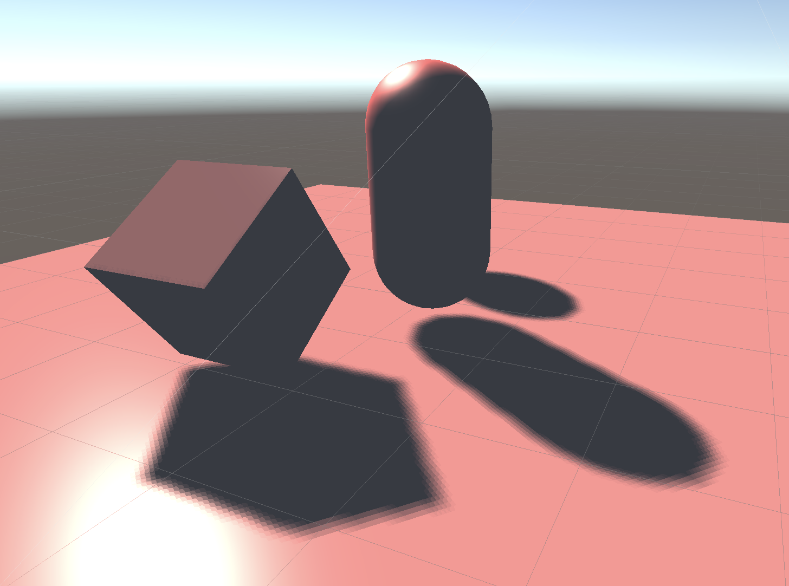

# Unity阴影渲染实现（三）——— PCF软阴影

紧接上一篇，这篇我们来实现PCF阴影解决锯齿问题。这里我所使用的pcf非常简单，就是直接根据filterSize的大小进行一个均值滤波。由于原理非常简单就直接上代码吧。

```c
float pcf(float depth, float2 uv, int filterSize)
{
    float shadow = 0.0;
    int halfSize = max(0, (filterSize - 1) / 2);
    for(int i = -halfSize; i <= halfSize; ++i)
    {
        for(int j = -halfSize; j < halfSize; ++j)
        {
            //这里进行采样时需要将uv乘上_shadowMapTexture_TexelSize来进行像素点偏移的采样
            float4 orignDepth = tex2D(_shadowMapTexture, uv + float2(i, j) * _shadowMapTexture_TexelSize.xy);
            float sampleDepth = DecodeFloatRGBA(orignDepth);
            shadow += (sampleDepth + _shadowBias) < depth ? _shadowStrength : 1;
        }
    }
    return shadow / (filterSize * filterSize);
}
```

再来看看PCF之后的使用低分辨率深度贴图的阴影效果，可以看到锯齿的现象已经明显改善了许多，甚至有了软阴影的感觉。图中的效果我所取得filterSize的大小为5。


