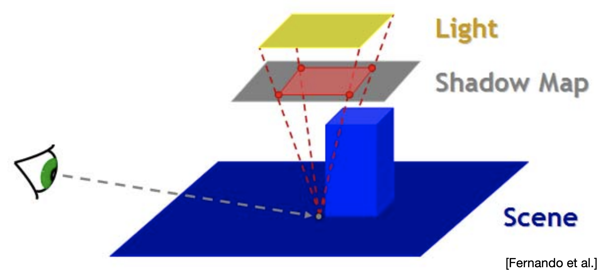
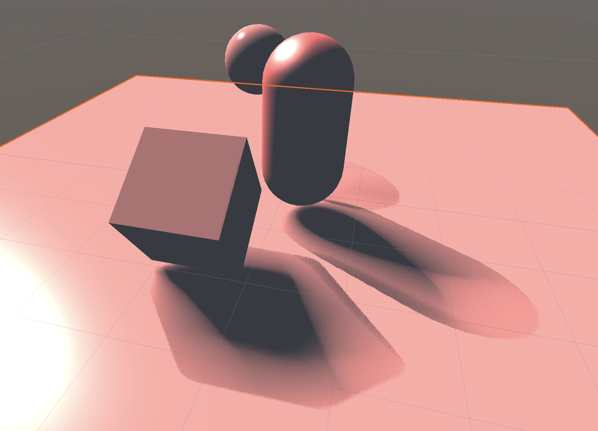
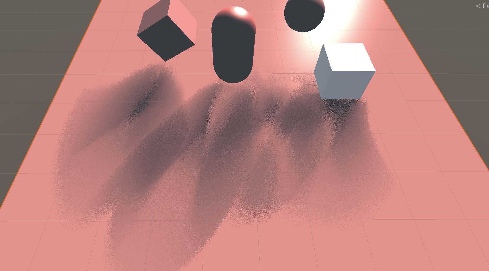

# Unity阴影渲染实现（四）——— PCSS软阴影

这篇我们来实现PCSS软阴影。PCSS的实现就有些许复杂起来了。计算过程一共分为三个部分：

1. Blocker Search

    在一个特定的范围内获取Blocker平均深度。

2. Penumbra Estimation

    使用获取的Blocker深度来进行filter大小的计算。

3. Percentage Closer Filtering

    使用PCF进行阴影计算。

那首先就来实现第一步`Blocker Search`。

在做这一步之前，首先我们要假设把阴影贴图放在光源与阴影接收面中间的某个位置，没错就是那张图所描述的。



同时，也需要假设这个光源是一个面光源。这样就得到了一个光源Size的值。有了这两个值之后我们可以利用图中这两个相似三角形的比来计算出我们需要在shadow map中搜索blocker的范围是多少，然后计算出他们的平均深度即可。

但是这里我们并不像上面的PCF那样去搜索每一个点，而是根据柏松分布来随机采样一定的搜索点，通过这种方式来降低计算量。给出的代码如下

```c
float findBlocker(float depth, float2 uv)
{
    int blockerSearchNumSamples = _Samples;
    float lightSizeUV = _LightSize / _LightFrustumWidth;
    float searchRadius = lightSizeUV * (depth - _NearPlane) / depth;
    float blockerDepthSum = 0.0;
    int numBlockers = 0;
    for(int i = 0; i < blockerSearchNumSamples; i++)
    {
        float4 orignDepth = tex2D(_shadowMapTexture, uv + poissonDisk[i] *  searchRadius);
        float sampleDepth = DecodeFloatRGBA(orignDepth);

        if(sampleDepth < depth)
        {
            blockerDepthSum += sampleDepth;
            numBlockers++;
        }
    }
    if(numBlockers == 0)
    {
        return -1.0;
    }
    return blockerDepthSum / numBlockers;
}
```

接下来第二步是计算在深度贴图中使用PCF采样的filter的大小。这里也要分为两步进行计算。主要也是通过两个相似三角形进行相比来得出。

```c
//计算该点投影在平面上影子大小（软阴影的大小）
float penumbraRatio = (depth - avgBlockerDepth) / avgBlockerDepth * _LightSize;
//通过影子大小反过来计算在ShadowMap上的filter大小
float filterSize = penumbraRatio * _NearPlane / depth;
```

最后一步就是对每一个区域做不同filter大小的PCF采样了。这里同样使用柏松分布进行随机采点，而不是像上面那样对每一个像素点都进行采样。

```c
float pcfSample(float depth, float2 uv, float filterSize)
{
    float shadow = 0.0;
    int numSamples = _Samples;

    for(int i  = 0; i < numSamples; ++i)
    {
        float4 orignDepth = tex2D(_shadowMapTexture, uv + poissonDisk[i] *  filterSize);
        float sampleDepth = DecodeFloatRGBA(orignDepth);
        shadow += (sampleDepth + _shadowBias) < depth ? _shadowStrength : 1;
    }

    for(int i  = 0; i < numSamples; ++i)
    {
        float4 orignDepth = tex2D(_shadowMapTexture, uv - poissonDisk[i] * filterSize);
        float sampleDepth = DecodeFloatRGBA(orignDepth);
        shadow += (sampleDepth + _shadowBias) < depth ? _shadowStrength : 1;
    }
    return shadow / (2.0 * numSamples);
}
```

这样子就能实现一个基本的PCSS软阴影的效果了。调了调参数，大概就是这个效果



调一调参数也可以调出更夸张的阴影效果（但是总感觉不管怎么调也没有别人做的好看，之后再想办法优化优化吧）


