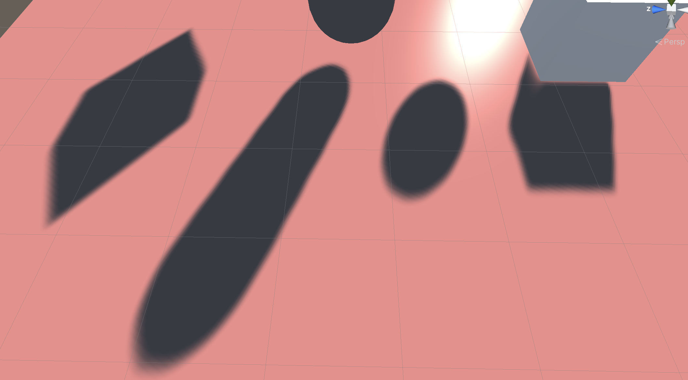
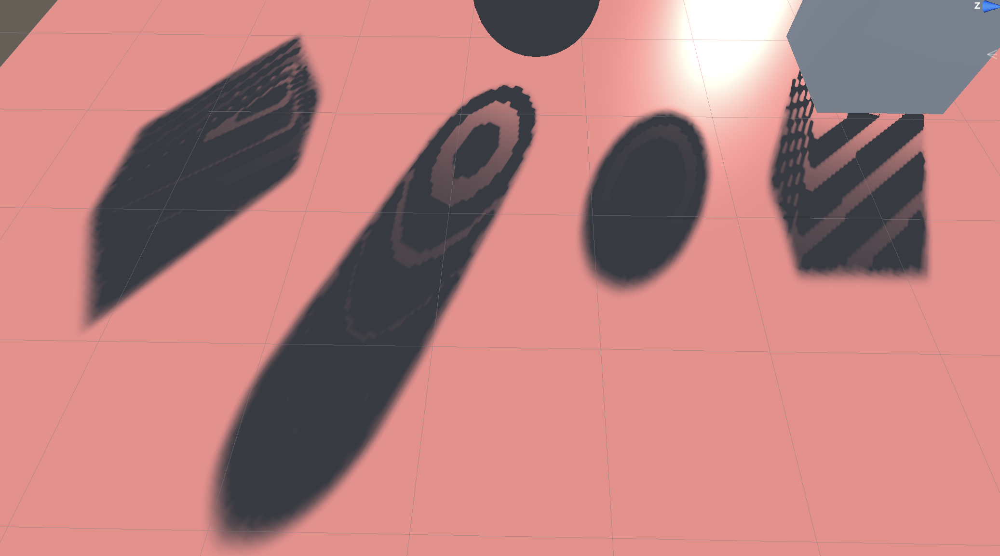

# Unity阴影渲染实现（五）VSSM软阴影

这篇我们来实现为了优化PCSS的计算量而诞生的VSSM，VSSM实现的关键在于在阴影贴图中需要同时存储深度以及深度的平方，这就需要我们对计算深度贴图的着色器进行更改。改法也很简单，直接把这两个值输出就好了。不过我在这边是直接存了深度的4次方。

```c
fixed4 frag(v2f i) : SV_Target
{
    float depth = i.position.z / i.position.w;
    
    #if defined(SHADER_TARGET_GLSL)
        depth = depth * 0.5 + 0.5;
    #elif defined(UNITY_REVERSED_Z)
        depth = 1 - depth;
    #endif
    
    float depth2 = depth * depth;
    float depth3 = depth2 * depth;
    float depth4 = depth3 * depth;

    return float4(depth, depth2, depth3, depth4);
}
```

然后由于在计算方差的时候，需要用到的是一个区域内深度的期望以及深度的平方的期望，也就是

$$ Var(X) = E(X^2) - E^2(X) $$

显然直接用这张深度贴图丢进着色器里面是获取不到这个期望值的。这里就先把这张计算好的深度贴图丢进`Compute Shader`里头做一次均值滤波。在脚本当中稍稍加几行调用调用计算着色器的代码。

```cs
//循环次数为调用compute shader的次数，每一次调用都在compute shader里面执行一次3*3的均值滤波
for (int i = 0; i < 7; ++i)
{
    blurShader.SetTexture(0, "Read", _texture);
    blurShader.SetTexture(0, "Result", _blurTexture);
    blurShader.Dispatch(0, _texture.width / 8, _texture.height / 8, 1);
    
    Swap(ref _texture, ref _blurTexture);
}
```

也顺便学习了一下Unity的Compute Shader的写法

```c
void CSMain (uint3 id : SV_DispatchThreadID)
{
    float4 pixel = float4(0, 0, 0, 0);
    for(int i = -1; i <= 1; ++i)
    {
        for(int j = -1; j <= 1; ++j)
        {
            uint2 index = id.xy;
            index.x += i;
            index.y += j;
            pixel += Read[index.xy] / 9;
        }
    }
    pixel.a = 1;
    Result[id.xy] = pixel;
}
```

接着把做完处理的贴图传给阴影着色器，在计算方差时候就只需要采样对应像素的深度和深度平方的值，直接做差就可以了。后面的步骤就只要按着公式走就可以了。

```c
//核心代码就这一些
float vssm(float depth, float2 uv)
{
    float4 depthTexture = tex2D(_shadowMapTexture, uv);

    float d1 = depthTexture.r;
    float d2 = depthTexture.g;
    float variance = clamp(d2 - d1 * d1, 0, 1);
    float delta = depth - d1;

    if((d1 + _shadowBias) < depth)
    {
        float p1 = variance;
        float p2 = variance + delta * delta;
        float p = p1 / p2;
        return p;
    } else
    {
        return 1.0;
    }
}
```

这是VSSM最终实现的效果



需要注意的是，进行VSSM深度贴图计算的时候，需要把生成纹理的格式更改为`RGFLOAT`从而获得更高的精度，否则在计算深度平方的时候会因为精度问题而导致误差，这个误差在进行方差计算的时候会有非常大的影响。这个问题困扰了非常久，当时也猜到了是精度问题，但是没想到最后的解决方式是修改了纹理格式。

这里也放上以上错误的效果示范

