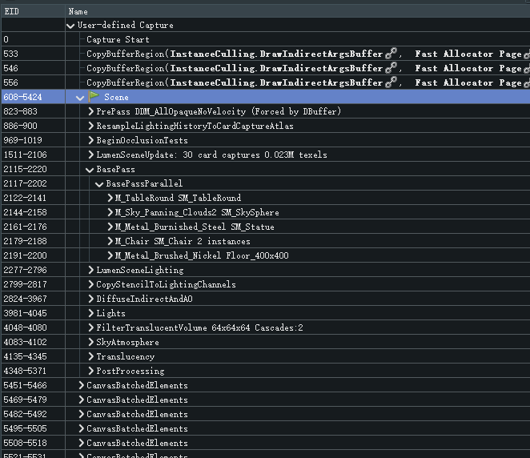
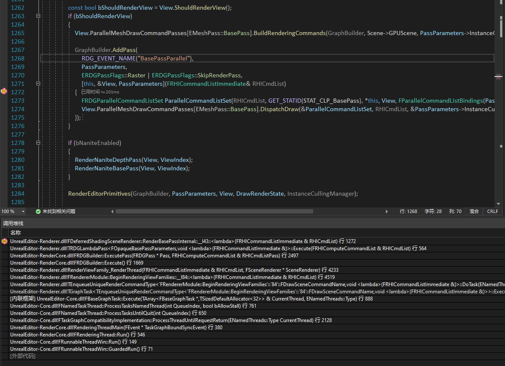

# UE5渲染管线概览

这段时间元宇宙大火，又恰逢UE5的第一个正式版发布，无论是游戏行业还是其他的什么Web3.0都搞得风风火火，作为互联网的赶潮儿，怎么能不跟上这股潮流。这次就来学习一下UE5吧。

不过从哪儿开始呢，作为一个UE萌新，直接上手太难的部分也不太适合，那就先看看UE引以为豪的渲染管线吧。但是想必很多新手都和我一样有一个困惑，那就是UE的代码量这么大，该怎么找到我想看的东西在哪儿呢，别急别急，看渲染当然是要从截帧开始啦。那就让我们先截个帧吧。

## RenderDoc寻找入口

这里使用的是ue5-main分支。

随便新建一个空项目，在插件中打开RenderDoc插件，点击右上角的截帧按钮截帧，没几秒就截出来了。先来看看这一帧当中，UE都做了些啥事。下图是筛选了draw关键字之后的结果。



可以看到在Scene这个Pass下面就是整个场景的渲染了，接下来就是根据这张图来找到对应的代码都在什么位置了。随便找个不容易重名的pass名称，在VS中进行全局搜索，这里我就搜一个BasePass下面的BasePassParallel，找到一个AddPass的地方，打上断点，返回UE，发现断点立马就被触发了，那么接下来我们就可以根据堆栈来进行整个渲染管线的分析了。

断点位置与堆栈调用信息如下图所示



逐级查看调用堆栈，会发现在`RenderViewFamily_RenderThread(FRHICommandListImmediate& RHICmdList, FSceneRenderer* SceneRenderer)`这个函数中，有这样一段代码

```cpp
if (ViewFamily.EngineShowFlags.HitProxies)
{
    // Render the scene's hit proxies.
    SceneRenderer->RenderHitProxies(GraphBuilder);
    bAnyShowHitProxies = true;
}
else
{
    // Render the scene.
    SceneRenderer->Render(GraphBuilder);
}
GraphBuilder.Execute();
```

很显然，这里就是整个UE整个场景渲染的入口了。这里主要有三条函数，下面两条看名称就非常容易理解，分别是场景渲染RDG的配置以及RDG的执行，而第一条RenderHitProxies，查阅官方文档对这个标志位的描述是这样的

> HitProxies: Draws each hit proxy in the scene with a different color, for now only available in the editor

也就是说这是在编辑器模式下渲染场景中的碰撞相关的东西，显然并不是我们这次需要关心的事情。那么事情可以向前再进一步，我们只需要进入Render函数进行分析就可以了。

由于这次调试是在PC上进行调试，所以这个SceneRenderer的类型是FDeferredShadingSceneRenderer，也就是UE最通用的延迟渲染管线，如果是启用了Mobile管线，便会进入Mobile管线的Render函数。

那么就先来看看这个延迟渲染管线中又做了一些什么事吧。

## 延迟渲染管线

如果代码跳转不好用，我们可以打个断点F11进去。总之现在我们已经找到了这个函数。

Render是一个1400多行的大函数，各个pass的具体的执行操作也没有在这个函数中展开，如果细细看定会需要花上不少的时间，这次我们不求细节，来草草看看里面大概做了哪些事情。

官方文档中有针对UE4版本的FDeferredShadingSceneRenderer::Render()函数相关的说明，尽管这个文档暂时并没有更新至UE5的版本，但是依旧能够给我们提供一些参考。文档的链接如下

https://docs.unrealengine.com/5.0/zh-CN/graphics-programming-overview-for-unreal-engine/

那么现在就正式开始来探究这个庞大的渲染函数吧。

官网文档中提及我们可以直接寻找对应的渲染事件来依次查看对应的实现，那么首先需要寻找的，就是Scene这个事件了，这是整个场景渲染的开始位置。而搜索一番之后，确实可以在函数中找到这么一行

```cpp
RDG_EVENT_SCOPE(GraphBuilder, "Scene");
```

那么从这一行可以得到这样两个信息

1. UE使用RDG_EVENT_SCOPE()这个宏来定义渲染事件。
2. 以这行为为界，可以将整个Render函数分为两个部分，上半部分是对一些模块的初始化以及配置，下半部分是执行场景的渲染。

那么先来看看上面的配置部分都做了哪些事吧。

### 渲染配置

把上半部分一些相对重要的操作提炼出来，可以大致把函数浓缩成下面这样

```cpp
//下方代码只为更加直观总结出每个阶段所做的操作，省去了部分判断逻辑与宏的使用，不保证代码逻辑与源码相同
//需要详细了解每个部分的细节还请移步源码

//查看Nanite是否启用
const bool bNaniteEnabled = IsNaniteEnabled();

//刷新RayTracing相关的Cache和资源
#if RHI_RAYTRACING
    Scene->RefreshRayTracingMeshCommandCache();
    Scene->RefreshRayTracingInstances();
#endif

//初始化每个View的Shader相关资源
for (int32 ViewIndex = 0; ViewIndex < Views.Num(); ViewIndex++) {
    ShaderPrint::BeginView(GraphBuilder, View);
    ShadingEnergyConservation::Init(GraphBuilder, View);
    ShaderPrint::EndView(View);
}

//更新所有场景资源
Scene->UpdateAllPrimitiveSceneInfos(GraphBuilder, true);

//Nanite资源的同步与更新
if (bNaniteEnabled) {
    Nanite::GGlobalResources.Update(GraphBuilder);
    Nanite::GStreamingManager.BeginAsyncUpdate(GraphBuilder);
    FNaniteVisualizationData& NaniteVisualization = GetNaniteVisualizationData();
    NaniteVisualization.Update(NaniteViewMode)
}

//设置最终渲染的View区域
PrepareViewRectsForRendering(GraphBuilder.RHICmdList);

//天空大气渲染设置
if (ShouldRenderSkyAtmosphere(Scene, ActiveViewFamily->EngineShowFlags) && !bPathTracedAtmosphere) {
    for (int32 LightIndex = 0; LightIndex < NUM_ATMOSPHERE_LIGHTS; ++LightIndex) {
        PrepareSunLightProxy(*Scene->GetSkyAtmosphereSceneInfo(),LightIndex, *Scene->AtmosphereLights[LightIndex]);
    }
} else {
    Scene->ResetAtmosphereLightsProperties();
}

//Multi GPU相关设置
#if WITH_MGPU
const FRHIGPUMask RenderTargetGPUMask = ComputeGPUMasks(GraphBuilder.RHICmdList);
#endif

//等待遮挡测试
WaitOcclusionTests(GraphBuilder.RHICmdList);
```

### 场景渲染

从这里开始，RDG的宏能够为我们分析这段代码提供不少帮助。依旧还是从上到下，我们按顺序去看每一段代码都在做什么。为了方便快速检索代码，下边也会把源码给贴出来。

- 给RT分配内存

```cpp
SCOPE_CYCLE_COUNTER(STAT_FDeferredShadingSceneRenderer_Render_Init);
RDG_RHI_GPU_STAT_SCOPE(GraphBuilder, AllocateRendertargets);

// Initialize global system textures (pass-through if already initialized).
GSystemTextures.InitializeTextures(GraphBuilder.RHICmdList, FeatureLevel);

// Force the subsurface profile texture to be updated.
UpdateSubsurfaceProfileTexture(GraphBuilder, ShaderPlatform);

// Force the rect light texture to be updated.
RectLightAtlas::UpdateRectLightAtlasTexture(GraphBuilder, FeatureLevel);
```

- 更新VT

```cpp
RDG_GPU_STAT_SCOPE(GraphBuilder, VirtualTextureUpdate);
// AllocateResources needs to be called before RHIBeginScene
FVirtualTextureSystem::Get().AllocateResources(GraphBuilder, FeatureLevel);
FVirtualTextureSystem::Get().CallPendingCallbacks();
VirtualTextureFeedbackBegin(GraphBuilder, Views, SceneTexturesConfig.Extent);
```

- 初始化可见性

```cpp
RDG_GPU_STAT_SCOPE(GraphBuilder, VisibilityCommands);
InitViews(GraphBuilder, SceneTexturesConfig, BasePassDepthStencilAccess, ILCTaskData, InstanceCullingManager);
```

- 为UniformBufferExtension准备视图

```cpp
for (IPersistentViewUniformBufferExtension* Extension : PersistentViewUniformBufferExtensions) {
    Extension->BeginFrame();
    for (int32 ViewIndex = 0; ViewIndex < Views.Num(); ViewIndex++) {
        Extension->PrepareView(&Views[ViewIndex]);
    }
}
```

- 为使用路径追踪进行渲染准备资源

```cpp
// Gather mesh instances, shaders, resources, parameters, etc. and build ray tracing acceleration structure
FRayTracingScene& RayTracingScene = Scene->RayTracingScene;
RayTracingScene.Reset();

const int32 ReferenceViewIndex = 0;
FViewInfo& ReferenceView = Views[ReferenceViewIndex];

// Prepare the scene for rendering this frame.
GatherRayTracingWorldInstancesForView(GraphBuilder, ReferenceView, RayTracingScene);
```

- 提交动态VB

```cpp
SCOPE_CYCLE_COUNTER(STAT_FDeferredShadingSceneRenderer_FGlobalDynamicVertexBuffer_Commit);
DynamicIndexBufferForInitViews.Commit();
DynamicVertexBufferForInitViews.Commit();
DynamicReadBufferForInitViews.Commit();
```

- 特效的预渲染，包括GPU粒子模拟等

```cpp
SCOPE_CYCLE_COUNTER(STAT_FDeferredShadingSceneRenderer_FXSystem_PreRender);
GraphBuilder.SetCommandListStat(GET_STATID(STAT_CLM_FXPreRender));
FXSystem->PreRender(GraphBuilder, Views, true /*bAllowGPUParticleUpdate*/);
if (FGPUSortManager* GPUSortManager = FXSystem->GetGPUSortManager()) {
    GPUSortManager->OnPreRender(GraphBuilder);
}
```

- 场景GPU资源的更新，包括Instance数据的更新和剔除，物理场的更新等

```cpp
RDG_GPU_STAT_SCOPE(GraphBuilder, GPUSceneUpdate);
Scene->GPUScene.Update(GraphBuilder, *Scene);
Scene->UpdatePhysicsField(GraphBuilder, View);
```

- 再一次更新VT，与上一次不同的是，上一次VT的更新主要还是处理资源的分配，这里是真正的对VT数据进行更新。

```cpp
RDG_GPU_STAT_SCOPE(GraphBuilder, VirtualTextureUpdate);
FVirtualTextureSystem::Get().Update(GraphBuilder, FeatureLevel, Scene);
```

- 判断是否进行光源剔除

```cpp
if (!IsSimpleForwardShadingEnabled(ShaderPlatform)) {
    bComputeLightGrid |= (
        ShouldRenderVolumetricFog() ||
        VolumetricCloudWantsToSampleLocalLights(Scene, ActiveViewFamily->EngineShowFlags) ||
        ActiveViewFamily->ViewMode != VMI_Lit ||
        bAnyLumenEnabled ||
        ActiveViewFamily->VirtualShadowMapArray.IsEnabled());
}
```

- 判断是否进行遮挡剔除与深度测试

```cpp
const bool bIsOcclusionTesting = DoOcclusionQueries() && !ActiveViewFamily->EngineShowFlags.DisableOcclusionQueries
    && (!ActiveViewFamily->EngineShowFlags.Wireframe || bIsViewFrozen || bHasViewParent);
const bool bNeedsPrePass = ShouldRenderPrePass();
```

- 绘制深度

```cpp
if (DepthPass.IsComputeStencilDitherEnabled()) {
    AddDitheredStencilFillPass(GraphBuilder, Views, SceneTextures.Depth.Target, DepthPass);
}
```

- 发丝相关的计算

```cpp
if (IsHairStrandsEnabled(EHairStrandsShaderType::All, Scene->GetShaderPlatform())) {
    if (bRunHairStrands) {
        RunHairStrandsBookmark(GraphBuilder, EHairStrandsBookmark::ProcessStrandsInterpolation, HairStrandsBookmarkParameters);
    } else {
        for (FViewInfo& View : Views) {
            View.HairStrandsViewData.UniformBuffer = HairStrands::CreateDefaultHairStrandsViewUniformBuffer(GraphBuilder, View);
        }
    }
}
```

- 更新Nanite Streaming

```cpp
if (bUpdateNaniteStreaming) {
    Nanite::GStreamingManager.EndAsyncUpdate(GraphBuilder);
}
```

- 距离场的计算

```cpp
RDG_RHI_GPU_STAT_SCOPE(GraphBuilder, GPUSceneUpdate);
PrepareDistanceFieldScene(GraphBuilder, false);
```

- Prepass深度剔除

```cpp
GraphBuilder.SetCommandListStat(GET_STATID(STAT_CLM_PrePass));
if (bNeedsPrePass) {
    RenderPrePass(GraphBuilder, SceneTextures.Depth.Target, InstanceCullingManager);
} else {
    // We didn't do the prepass, but we still want the HMD mask if there is one
    RenderPrePassHMD(GraphBuilder, SceneTextures.Depth.Target);
}
```
- Lumen相关的可见性计算与动态VB设置，在InitViewsAfterPrepass()函数中主要进行动态阴影初始化，反射探针Buffer设置等。

```cpp
FLumenSceneFrameTemporaries LumenFrameTemporaries;

RDG_RHI_GPU_STAT_SCOPE(GraphBuilder, VisibilityCommands);
InitViewsAfterPrepass(GraphBuilder, LumenFrameTemporaries, ILCTaskData, InstanceCullingManager);

SCOPE_CYCLE_COUNTER(STAT_FDeferredShadingSceneRenderer_FGlobalDynamicVertexBuffer_Commit);
DynamicVertexBufferForInitShadows.Commit();
DynamicIndexBufferForInitShadows.Commit();
DynamicReadBufferForInitShadows.Commit();
```

- Nanite光栅化与剔除

```cpp
Nanite::CullRasterize(
    GraphBuilder,
    Scene->NaniteRasterPipelines[ENaniteMeshPass::BasePass],
    *Scene,
    View,
    { PackedView },
    SharedContext,
    CullingContext,
    RasterContext,
    RasterState,
    /*OptionalInstanceDraws*/ nullptr,
    bExtractStats
);
```

- Resolve Depth，这个Pass只会在启用MSAA的情况下执行

```cpp
AddResolveSceneDepthPass(GraphBuilder, Views, SceneTextures.Depth);
```

- 光源排序，遮挡剔除，与剔除后的光照计算

```cpp
RDG_GPU_STAT_SCOPE(GraphBuilder, SortLights);
GatherLightsAndComputeLightGrid(GraphBuilder, bComputeLightGrid, SortedLightSet);

RenderOcclusion(GraphBuilder, SceneTextures, bIsOcclusionTesting);

CompositionLighting.ProcessAfterOcclusion(GraphBuilder);
```

- 距离场阴影投影计算

```cpp
BeginAsyncDistanceFieldShadowProjections(GraphBuilder, SceneTextures);
```

- 体积云，天空大气与实时环境反射相关初始化

```cpp
InitVolumetricRenderTargetForViews(GraphBuilder, Views);

InitVolumetricCloudsForViews(GraphBuilder, bShouldRenderVolumetricCloudBase, InstanceCullingManager);

RenderSkyAtmosphereLookUpTables(GraphBuilder);

Scene->AllocateAndCaptureFrameSkyEnvMap(GraphBuilder, *this, MainView, bShouldRenderSkyAtmosphere, bShouldRenderVolumetricCloud, InstanceCullingManager);
```

- 自定义深度计算

```cpp
RenderCustomDepthPass(GraphBuilder, SceneTextures.CustomDepth, SceneTextures.GetSceneTextureShaderParameters(FeatureLevel));
```

- Lumen场景更新，主要包括光照贴图的渲染等

```cpp
UpdateLumenScene(GraphBuilder, LumenFrameTemporaries);
```

- 在前向渲染的情况下，渲染阴影深度，头发，以及阴影投影，以及体积雾

```cpp
if (IsForwardShadingEnabled(ShaderPlatform)) {
    RenderShadowDepthMaps(GraphBuilder, InstanceCullingManager);

    if (bHairStrandsEnable && !bHasRayTracedOverlay) {
        RenderHairPrePass(GraphBuilder, Scene, Views, InstanceCullingManager);
        RenderHairBasePass(GraphBuilder, Scene, SceneTextures, Views, InstanceCullingManager);
    }

    RenderForwardShadowProjections(GraphBuilder, SceneTextures, ForwardScreenSpaceShadowMaskTexture, ForwardScreenSpaceShadowMaskHairTexture);

    ComputeVolumetricFog(GraphBuilder, SceneTextures);
}
```

- DBuffer相关的处理，主要包括DBuffer贴花的计算与SSAO

```cpp
CompositionLighting.ProcessBeforeBasePass(GraphBuilder, DBufferTextures);
```

- 前向渲染的情况下，IndirectCapsuleShadows的绘制

```cpp
if (IsForwardShadingEnabled(ShaderPlatform) && bAllowStaticLighting){
    RenderIndirectCapsuleShadows(GraphBuilder, SceneTextures);
}
```

- BasePass，场景中物件的渲染，主要绘制各物件的GBuffer

```cpp
RenderBasePass(GraphBuilder, SceneTextures, DBufferTextures, BasePassDepthStencilAccess, ForwardScreenSpaceShadowMaskTexture, InstanceCullingManager, bNaniteEnabled, NaniteRasterResults);
```

- Nanite可视化

```cpp
Nanite::AddVisualizationPasses(
    GraphBuilder,
    Scene,
    SceneTextures,
    ActiveViewFamily->EngineShowFlags,
    Views,
    NaniteRasterResults
);
```

- 实时天空球捕获

```cpp
if (bRealTimeSkyCaptureEnabled){
    Scene->ValidateSkyLightRealTimeCapture(GraphBuilder, Views[0], SceneTextures.Color.Target);
}
```

- 体积光可视化

```cpp
VisualizeVolumetricLightmap(GraphBuilder, SceneTextures);
```

- 如果在BasePass之前没有做遮挡剔除与光照计算，则在这里做

```cpp
if (!bOcclusionBeforeBasePass) {
    RenderOcclusionLambda();
}
```

- Resolve Scene Color，同样只在MSAA开启的情况下进行

```cpp
AddResolveSceneColorPass(GraphBuilder, Views, SceneTextures.Color);
```

- 如果是非前向渲染，则头发的渲染在这里进行

```cpp
if (bHairStrandsEnable && !IsForwardShadingEnabled(ShaderPlatform) && !bHasRayTracedOverlay) {
    RenderHairPrePass(GraphBuilder, Scene, Views, InstanceCullingManager);
    RenderHairBasePass(GraphBuilder, Scene, SceneTextures, Views, InstanceCullingManager);
}
```

- BasePass之后的阴影深度，Lumen光照以及体积雾计算

```cpp
RenderShadowDepthMaps(GraphBuilder, InstanceCullingManager);
RenderLumenSceneLighting(GraphBuilder, LumenFrameTemporaries);
ComputeVolumetricFog(GraphBuilder, SceneTextures);
```

- Nanite Streaming请求递交

```cpp
Nanite::GStreamingManager.SubmitFrameStreamingRequests(GraphBuilder);
```

- BasePass之后的Custom Depth绘制

```cpp
if (CustomDepthPassLocation == ECustomDepthPassLocation::AfterBasePass) {
    RenderCustomDepthPass(GraphBuilder, SceneTextures.CustomDepth, SceneTextures.GetSceneTextureShaderParameters(FeatureLevel));
}
```

- Velocity的渲染

```cpp
RenderVelocities(GraphBuilder, SceneTextures, EVelocityPass::Opaque, bHairStrandsEnable);
```

- 延迟渲染的光照合成，贴花，以及SSAO

```cpp
CSV_SCOPED_TIMING_STAT_EXCLUSIVE(AfterBasePass);
SCOPE_CYCLE_COUNTER(STAT_FDeferredShadingSceneRenderer_AfterBasePass);

if (!IsForwardShadingEnabled(ShaderPlatform)) {
    AddResolveSceneDepthPass(GraphBuilder, Views, SceneTextures.Depth);
}

CompositionLighting.ProcessAfterBasePass(GraphBuilder);
```

- 等待路径追踪的光照计算

```cpp
WaitForRayTracingScene(GraphBuilder, DynamicGeometryScratchBuffer);
```

- Lumen光照计算，包括间接光照，AO，天空光，发丝次表面散射等计算

```cpp
RDG_GPU_STAT_SCOPE(GraphBuilder, RenderDeferredLighting);
RDG_CSV_STAT_EXCLUSIVE_SCOPE(GraphBuilder, RenderLighting);
SCOPE_CYCLE_COUNTER(STAT_FDeferredShadingSceneRenderer_Lighting);

BeginGatheringLumenSurfaceCacheFeedback(GraphBuilder, Views[0], LumenFrameTemporaries);
RenderDiffuseIndirectAndAmbientOcclusion(GraphBuilder, SceneTextures, LumenFrameTemporaries, LightingChannelsTexture, /* bIsVisualizePass = */ false);
RenderIndirectCapsuleShadows(GraphBuilder, SceneTextures);
RenderDFAOAsIndirectShadowing(GraphBuilder, SceneTextures, DynamicBentNormalAOTexture);
RenderLights(GraphBuilder, SceneTextures, TranslucencyLightingVolumeTextures, LightingChannelsTexture, SortedLightSet);
RenderDeferredReflectionsAndSkyLighting(GraphBuilder, SceneTextures, DynamicBentNormalAOTexture);
RenderGlobalIlluminationPluginVisualizations(GraphBuilder, LightingChannelsTexture);
AddSubsurfacePass(GraphBuilder, SceneTextures, Views);
RenderHairStrandsSceneColorScattering(GraphBuilder, SceneTextures.Color.Target, Scene, Views);
```

- 环境的渲染，包括光束的渲染，大气的渲染，雾的渲染以及体积云的渲染

```cpp
// Draw Lightshafts
if (!bHasRayTracedOverlay && ActiveViewFamily->EngineShowFlags.LightShafts)
{
    SCOPE_CYCLE_COUNTER(STAT_FDeferredShadingSceneRenderer_RenderLightShaftOcclusion);
    LightShaftOcclusionTexture = RenderLightShaftOcclusion(GraphBuilder, SceneTextures);
}

// Draw the sky atmosphere
if (!bHasRayTracedOverlay && bShouldRenderSkyAtmosphere)
{
    SCOPE_CYCLE_COUNTER(STAT_FDeferredShadingSceneRenderer_RenderSkyAtmosphere);
    RenderSkyAtmosphere(GraphBuilder, SceneTextures);
}

// Draw fog.
if (!bHasRayTracedOverlay && ShouldRenderFog(*ActiveViewFamily))
{
    RDG_CSV_STAT_EXCLUSIVE_SCOPE(GraphBuilder, RenderFog);
    SCOPE_CYCLE_COUNTER(STAT_FDeferredShadingSceneRenderer_RenderFog);
    RenderFog(GraphBuilder, SceneTextures, LightShaftOcclusionTexture);
}

// After the height fog, Draw volumetric clouds (having fog applied on them already) when using per pixel tracing,
if (!bHasRayTracedOverlay && bShouldRenderVolumetricCloud)
{
    bool bSkipVolumetricRenderTarget = true;
    bool bSkipPerPixelTracing = false;
    RenderVolumetricCloud(GraphBuilder, SceneTextures, bSkipVolumetricRenderTarget, bSkipPerPixelTracing, HalfResolutionDepthCheckerboardMinMaxTexture, false, InstanceCullingManager);
}
```

- 不透明特效的渲染

```cpp
RenderOpaqueFX(GraphBuilder, Views, FXSystem, SceneTextures.UniformBuffer);
```

- 透明Pass之前，发丝的合成

```cpp
if (GetHairStrandsComposition() == EHairStrandsCompositionType::BeforeTranslucent) {
    RDG_GPU_STAT_SCOPE(GraphBuilder, HairRendering);
    RenderHairComposition(GraphBuilder, Views, SceneTextures.Color.Target, SceneTextures.Depth.Target);
}
```

- 透明Pass

```cpp
RDG_EVENT_SCOPE(GraphBuilder, "Translucency");
RenderTranslucency(GraphBuilder, SceneTextures, TranslucencyLightingVolumeTextures, &TranslucencyResourceMap, TranslucencyViewsToRender, InstanceCullingManager);
```

- 透明Pass之后，发丝的合成

```cpp
if (GetHairStrandsComposition() == EHairStrandsCompositionType::AfterTranslucent) {
    RDG_GPU_STAT_SCOPE(GraphBuilder, HairRendering);
    RenderHairComposition(GraphBuilder, Views, SceneTextures.Color.Target, SceneTextures.Depth.Target);
}
```

- Distortion的渲染

```cpp
GraphBuilder.SetCommandListStat(GET_STATID(STAT_CLM_Distortion));
RenderDistortion(GraphBuilder, SceneTextures.Color.Target, SceneTextures.Depth.Target);
```

- 透明物体的Velosity渲染

```cpp
GraphBuilder.SetCommandListStat(GET_STATID(STAT_CLM_TranslucentVelocity));
RenderVelocities(GraphBuilder, SceneTextures, EVelocityPass::Translucent, false);
```

- Shader Debug信息的绘制

```cpp
for (FViewInfo& View : Views) {
    ShadingEnergyConservation::Debug(GraphBuilder, View, SceneTextures);
}
```

- 光线Bloom的渲染

```cpp
SCOPE_CYCLE_COUNTER(STAT_FDeferredShadingSceneRenderer_RenderLightShaftBloom);
GraphBuilder.SetCommandListStat(GET_STATID(STAT_CLM_LightShaftBloom));
RenderLightShaftBloom(GraphBuilder, SceneTextures, /* inout */ TranslucencyResourceMap);
```

- 路径追踪以及路径追踪的Debug信息

```cpp
RenderPathTracing(GraphBuilder, View, SceneTextures.UniformBuffer, SceneTextures.Color.Target);
RenderRayTracingDebug(GraphBuilder, View, SceneTextures.Color.Target);
```

- 物理场渲染

```cpp
RenderPhysicsField(GraphBuilder, Views, Scene->PhysicsField, SceneTextures.Color.Target);
```

- 距离场光照渲染

```cpp
RenderDistanceFieldLighting(GraphBuilder, SceneTextures, FDistanceFieldAOParameters(OcclusionMaxDistance), DummyOutput, false, ActiveViewFamily->EngineShowFlags.VisualizeDistanceFieldAO);
```

- 网格距离场可视化

```cpp
RenderMeshDistanceFieldVisualization(GraphBuilder, SceneTextures, FDistanceFieldAOParameters(Scene->DefaultMaxDistanceFieldOcclusionDistance));
```

- 间接光AO

```cpp
RenderLumenMiscVisualizations(GraphBuilder, SceneTextures, LumenFrameTemporaries);
RenderDiffuseIndirectAndAmbientOcclusion(GraphBuilder, SceneTextures, LumenFrameTemporaries, LightingChannelsTexture, /* bIsVisualizePass = */ true);
```

- 重叠光源渲染

```cpp
RenderStationaryLightOverlap(GraphBuilder, SceneTextures, LightingChannelsTexture);
```

- 后处理

```cpp
RDG_EVENT_SCOPE(GraphBuilder, "PostProcessing");
RDG_GPU_STAT_SCOPE(GraphBuilder, Postprocessing);
AddPostProcessingPasses(GraphBuilder, View, ViewIndex, bAnyLumenActive, PostProcessingInputs, NaniteResults, InstanceCullingManager, &ActiveViewFamily->VirtualShadowMapArray, LumenFrameTemporaries);
```

到这里整个场景的渲染基本上就算是结束了，可以发现这个函数里面包含了非常多的逻辑，有些渲染根据配置不同前前后后反复出现，例如Depth贴图的绘制等等，根据是否开启PreZ，是否是前向渲染还是延迟渲染，都会被放到不同的地方去执行，上面对整个函数逻辑的摘抄只为了解个大概，毕竟每一个阶段的调用函数进去之后，又是一个个可以深入研究的话题。

同时，把关键代码摘抄出来，也方便日后进行某一个模块开发的时候直接对源码位置进行一个定位，不过这就是后面的话题了。

不过总的来说，整个渲染流程中调用的东西可以分为这几个模块

- 延迟管线的绘制
- 前向管线的绘制
- 路径追踪管线的渲染
- Lumen的配置与渲染
- Nanite的配置与渲染
- 场景环境光照（天空，大气，云）的配置与渲染

对整个渲染流程的粗略一看，免不了会有错误和疏漏，但是也不要紧，看完之后还是能够知道UE5在渲染中大概去做了哪些事情。出了这个延迟渲染管线，UE5中还包含一个Mobile管线，这里就不作分析了。

另外，对于是否要把使用RenderDoc寻找源码的切入点给写出来，其实纠结了蛮久，最终还是打算写一下。我相信还是有不少朋友在最开始想要学习UE源码时在茫茫代码中不知从哪里去找自己想看的那部分，也不知道如何上手。这里就当作是给像我一样不知道从哪儿开始的朋友们做个参考。