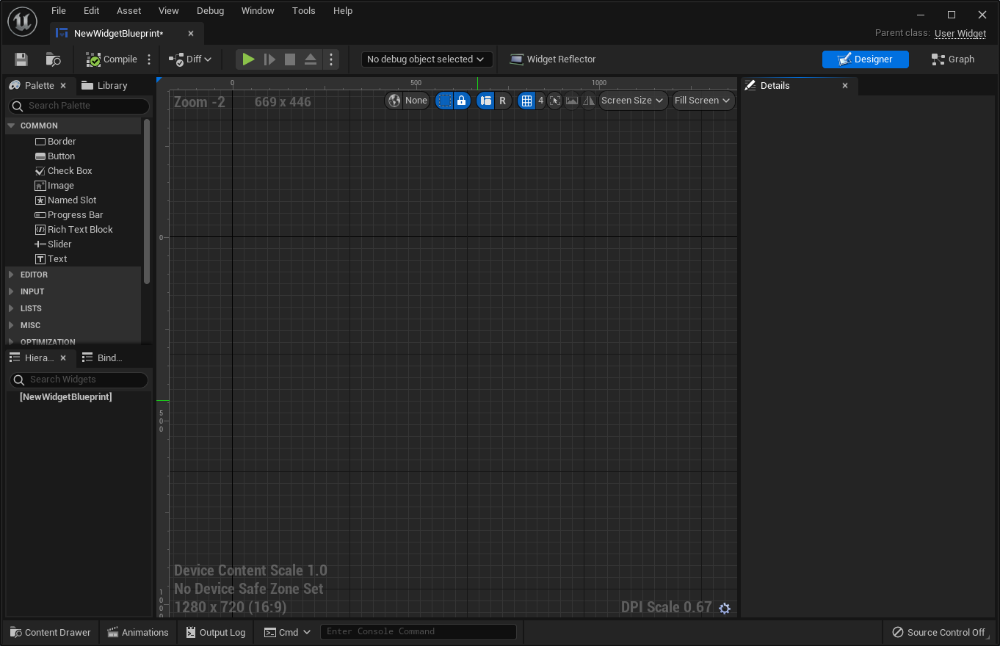
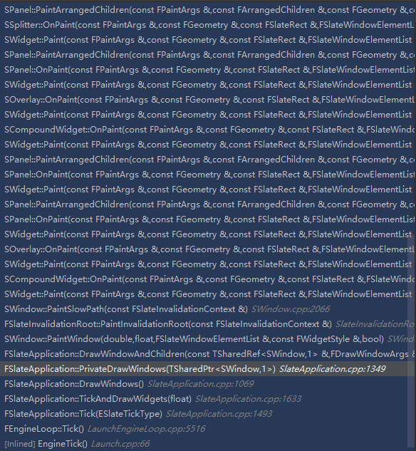

# Slate渲染流程概览

上一篇大概看了看UE5的场景渲染流程中包含了哪些步骤，但是还有一部分的渲染并不包含在场景的渲染流程中，那就是UI部分的渲染，如果不打开对应的命令，截帧甚至也无法截到这一部分的渲染过程，那么今天就来看看UE的UI是如何被渲染出来的吧。

如果想要对UE的UI渲染过程进行截帧，必须先使用命令`renderdoc.CaptureAllActivity 1`来打开对UI进行截帧的选项。不过Slate的渲染过程并不像场景渲染管线那样，对不同的步骤有着明确的标注，Slate的截帧所截到的，都是一个个RenderBatch的绘制命令，对于分析UI的渲染流程并没有太大的帮助，但是如果自己对Slate进行了一些定制，则可以有效地帮助我们调试自己的代码是否出了问题。

那么话不多说，直接从源码入手吧。

## UMG

UE中的UMG模块是一个帮助我们对UI进行可视化设计的模块，想要使用它也非常简单，直接创建一个Widget Blueprint，然后双击打开就是UMG编辑器的画面了



左上角的Palette窗口里面，包含的就是各种UI组件，继承自UWidget类，这里就是我们对Slate源码进行分析的入口了，这边我就以Button这个控件为例进行分析。

## UWidget

找到这个Button的类UButton，可以看到经过了多重继承，最终UButton类继承自UWidget，在UButton的实现中，实现了三个UWidget的接口方法

```cpp
public:

	//~ Begin UWidget Interface
	virtual void SynchronizeProperties() override;
	//~ End UWidget Interface

protected：

	//~ Begin UWidget Interface
	virtual TSharedRef<SWidget> RebuildWidget() override;
#if WITH_EDITOR
	virtual TSharedRef<SWidget> RebuildDesignWidget(TSharedRef<SWidget> Content) override { return Content; }
#endif
	//~ End UWidget Interface
```

在RebuildWidget方法中，可以看到这个UButton在这里创建了一个SButton的实例，并为其指定了属性，其实这个SButton才是我们真正渲染的Slate组件，创建SButton之后，将其赋给了UButton自身的成员变量MyButton，如此以来，便完成了UWidget与SWidget的绑定工作，每当我们创建一个UWidget，背后必定有一个对应的SWidget被创建，这也是UMG模块与Slate模块所对应的关系。

```cpp
TSharedRef<SWidget> UButton::RebuildWidget()
{
	MyButton = SNew(SButton)
		.OnClicked(BIND_UOBJECT_DELEGATE(FOnClicked, SlateHandleClicked))
		.OnPressed(BIND_UOBJECT_DELEGATE(FSimpleDelegate, SlateHandlePressed))
		.OnReleased(BIND_UOBJECT_DELEGATE(FSimpleDelegate, SlateHandleReleased))
		.OnHovered_UObject( this, &ThisClass::SlateHandleHovered )
		.OnUnhovered_UObject( this, &ThisClass::SlateHandleUnhovered )
		.ButtonStyle(&WidgetStyle)
		.ClickMethod(ClickMethod)
		.TouchMethod(TouchMethod)
		.PressMethod(PressMethod)
		.IsFocusable(IsFocusable)
		;

	if ( GetChildrenCount() > 0 )
	{
		Cast<UButtonSlot>(GetContentSlot())->BuildSlot(MyButton.ToSharedRef());
	}
	
	return MyButton.ToSharedRef();
}
```

那么这两个类型的Widget如何完成数据的同步呢，这部分工作由`SynchronizeProperties`负责完成。这个函数每当我们在编辑器中更改UWidget属性的时候便会被调用，将修改后的数据传递给SWidget，从而完成数据同步。

```cpp
void UButton::SynchronizeProperties()
{
	Super::SynchronizeProperties();

	MyButton->SetColorAndOpacity( ColorAndOpacity );
	MyButton->SetBorderBackgroundColor( BackgroundColor );
}
```

如果我们要创建一个属于自己的新的Widget，上面这两个继承自UWidget的函数便是我们实现的重点，有了它们之后，一个UI控件的雏形便完成了。

至于真正的渲染过程，此时我们应该去找到对应的SButton来一探究竟。

## SWidget

打开SButton的头文件，映入眼帘的是两个特殊的宏`SLATE_BEGIN_ARGS()`和`SLATE_END_ARGS()`。这两个宏对应刚刚创建实例时所对应的`SNew()`方法，可以让我们通过Slate的机制快速构造出一个包含各种参数属性和绑定方法的SWidget。

接下来再看SButton所实现的SWidget的接口方法

```cpp
public:

	//~ SWidget overrides
	virtual int32 OnPaint(const FPaintArgs& Args, const FGeometry& AllottedGeometry, const FSlateRect& MyCullingRect, FSlateWindowElementList& OutDrawElements, int32 LayerId, const FWidgetStyle& InWidgetStyle, bool bParentEnabled) const override;
	virtual bool SupportsKeyboardFocus() const override;
	virtual void OnFocusLost( const FFocusEvent& InFocusEvent ) override;
	virtual FReply OnKeyDown( const FGeometry& MyGeometry, const FKeyEvent& InKeyEvent ) override;
	virtual FReply OnKeyUp( const FGeometry& MyGeometry, const FKeyEvent& InKeyEvent ) override;
	virtual FReply OnMouseButtonDown( const FGeometry& MyGeometry, const FPointerEvent& MouseEvent ) override;
	virtual FReply OnMouseButtonDoubleClick(const FGeometry& InMyGeometry, const FPointerEvent& InMouseEvent) override;
	virtual FReply OnMouseButtonUp( const FGeometry& MyGeometry, const FPointerEvent& MouseEvent ) override;
	virtual FReply OnMouseMove( const FGeometry& MyGeometry, const FPointerEvent& MouseEvent ) override;
	virtual void OnMouseEnter( const FGeometry& MyGeometry, const FPointerEvent& MouseEvent ) override;
	virtual void OnMouseLeave( const FPointerEvent& MouseEvent ) override;
	virtual void OnMouseCaptureLost(const FCaptureLostEvent& CaptureLostEvent) override;
	virtual bool IsInteractable() const override;
#if WITH_ACCESSIBILITY
	virtual TSharedRef<FSlateAccessibleWidget> CreateAccessibleWidget() override;
#endif
private:
	virtual FVector2D ComputeDesiredSize(float) const override;
	//~ SWidget
```

除开下面一堆对应鼠标点击事件的方法，那个`OnPaint`函数一定是我们需要找的那个。`Onpaint`的实现如下

```cpp
int32 SButton::OnPaint(const FPaintArgs& Args, const FGeometry& AllottedGeometry, const FSlateRect& MyCullingRect, FSlateWindowElementList& OutDrawElements, int32 LayerId, const FWidgetStyle& InWidgetStyle, bool bParentEnabled) const
{
	bool bEnabled = ShouldBeEnabled(bParentEnabled);
	bool bShowDisabledEffect = GetShowDisabledEffect();

	const FSlateBrush* BrushResource = !bShowDisabledEffect && !bEnabled ? &Style->Disabled : GetBorderImage();
	
	ESlateDrawEffect DrawEffects = bShowDisabledEffect && !bEnabled ? ESlateDrawEffect::DisabledEffect : ESlateDrawEffect::None;

	if (BrushResource && BrushResource->DrawAs != ESlateBrushDrawType::NoDrawType)
	{
		FSlateDrawElement::MakeBox(
			OutDrawElements,
			LayerId,
			AllottedGeometry.ToPaintGeometry(),
			BrushResource,
			DrawEffects,
			BrushResource->GetTint(InWidgetStyle) * InWidgetStyle.GetColorAndOpacityTint() * GetBorderBackgroundColor().GetColor(InWidgetStyle)
		);
	}

	return SCompoundWidget::OnPaint(Args, AllottedGeometry, MyCullingRect, OutDrawElements, LayerId, InWidgetStyle, bEnabled);
}
```

其中最核心的实现其实只有最下面两行，一个`MakeBox`和一个`OnPaint`的递归调用。这个`Onpaint`负责Slate控件树的递归调用，将控件进行逐级渲染，而`MakeBox`函数的功能，则是去生成该控件所对应的一个DrawElement，并将其加入整个SWindow的ElementList当中。在这一步之后，由当初SWidget所构成的控件树结构，将会被转化为一个包含绘制元素的ElementList，存放在一个SWindow当中，而SWindow，则可以理解为需要绘制的一整个窗口，其中包含了各种各样的UI控件。

## SlateRenderer

那么这就完了吗，事情还远远没有这么简单。如此一个个UI直接绘制出来，对性能而言是一笔极大的开销，UE当然也不会这么去做，接下来的事情就是喜闻乐见的合批过程，这个过程又从何开始分析呢，我们现在OnPaint方法中打个断点，看看他的调用堆栈如何。



从堆栈中可以看到明显的控件树递归调用过程，也可以发现该递归的入口，就是在`SlateApplication`中的`DrawWindowAndChildren`函数，继续往下看，发现下面只剩下只有一个值得注意的地方了

```cpp
Renderer->DrawWindows( DrawWindowArgs.OutDrawBuffer );
```

`DrawWindows`是一条虚函数，由具体的`SlateRenderer`子类进行实现。最通常使用的SlateRenderer子类是一个叫做`FSlateRHIRenderer`的类，那么就先来看看它的实现是怎样的。

真正的渲染命令藏在`FSlateRHIRenderer::DrawWindows_Private`当中

```cpp
// Skip the actual draw if we're in a headless execution environment
bool bLocalTakingAScreenShot = bTakingAScreenShot;
if (GIsClient && !IsRunningCommandlet() && !GUsingNullRHI)
{
  ENQUEUE_RENDER_COMMAND(SlateDrawWindowsCommand)(
    [Params, ViewInfo](FRHICommandListImmediate& RHICmdList)
    {
      Params.Renderer->DrawWindow_RenderThread(RHICmdList, *ViewInfo, *Params.WindowElementList, Params);
    }
  );
}
```

继续往下深入，会发现真正最终的渲染任务交给了`FSlateRHIRenderingPolicy::DrawElements`去完成，而真正的调用过程是这样的

```cpp
FSlateRHIRenderer::DrawWindow_RenderThread(){
  RenderSlateBatch(){
    FSlateRHIRenderingPolicy::DrawElements(){
      RHICmdList.DrawIndexedPrimitive(){}
    }
  }
}
```

而最终真正去渲染的数据，也都是存储在一个叫做`RenderBatch`的东西里面，并不是我们刚刚所看到的`DrawElement`，这个`RenderBatch`又是从何而来呢？

## RenderBatch

时间退回到渲染执行之前，会发现`RenderBatch`来自于`BatchData`，而`BatchData`又来自于`WindowElementList`

```cpp
FSlateBatchData& BatchData = WindowElementList.GetBatchData();

// Update the vertex and index buffer	
RenderingPolicy->BuildRenderingBuffers(RHICmdList, BatchData);

// This must happen after rendering buffers are created
ViewportInfo.ConditionallyUpdateDepthBuffer(BatchData.IsStencilClippingRequired(), ViewportInfo.DesiredWidth, ViewportInfo.DesiredHeight);

bool bHdrTarget = ViewportInfo.bSceneHDREnabled && !bCompositeUI;
RenderSlateBatch(BackBuffer, bClear, bHdrTarget, ViewportInfo, ViewMatrix, BatchData, RHICmdList, ViewportWidth, ViewportHeight, DrawCommandParams, RenderingPolicy, PostProcessBuffer);
```

回到`FSlateRHIRenderer::DrawWindows_Private`函数中，可以发现有一个叫`ElementBatcher`的东西，通过名字可以知道，这一定就是把`DrawElement`变成`RenderBatch`的东西了。找到它所调用的`AddElements`函数来一窥究竟。

果不其然，在`FSlateElementBatcher::AddElementsInternal`中，根据`DrawElement`的类型，会调用对应的`CreateXXElement`函数，在其中可以找到调用了`CreateRenderBatch`方法，来创建对应的`RenderBatch`并且加入到`ElementList`当中。

在生成`RenderBatch`时，UE会计算出每个UI的顶点位置，以及对应的属性，并且将这些顶点全部放入一个大的VertexBuffer当中。当然，Slate绘制所用的用来存放顶点数据的数据类型也是根据Slate所定制的一个叫做`FSlateVertex`的结构体，其中只能够存放二维的顶点数据，而不能存放三维顶点数据。如果想要自己在Slate上做一些定制的话，这是一个值得注意的点。

`RenderBatch`中存放了所有绘制所需要的数据，包括Shader参数，顶点数据，绘制所包含的一些效果等等

再回到`FSlateRHIRenderingPolicy::DrawElements`当中，看看整个绘制过程如何。由于Slate的渲染并没有使用RDG，整个绘制过程并不难懂，这边也不再展开了。

Slate的分析到这里就结束了，从编辑器触手可及的UMG开始，慢慢深入到最后RenderBatch的绘制，这便是整个Slate的渲染过程。如果要对Slate的渲染流程做什么定制的话，按照这条思路进行也能够解决大部分的问题，无论是创建自己的自定义控件，还是在渲染流程中加一些什么自定效果，都可以轻松完成。